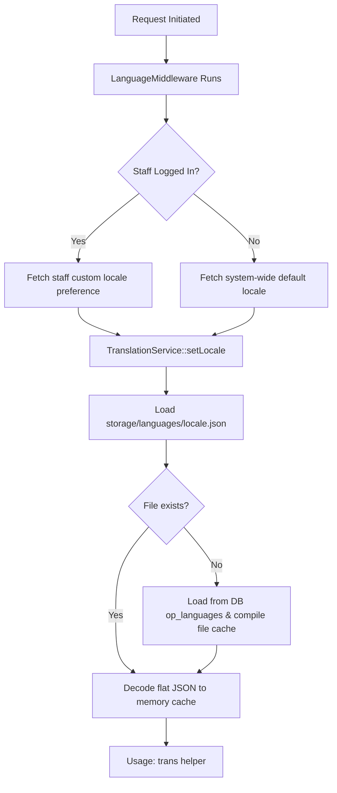

OwnPay has an internationalization (i18n) and localization architecture that delivers a localized administrative panel and white-labeled, customer-facing checkout interfaces. This guide covers the translation system, locale resolution flow, usage in PHP code and Twig templates, and how you can contribute or manage translation catalogs.

---

## 1. Core Architecture

OwnPay uses a hybrid **Database-and-Filesystem** storage pattern for language translation files to ensure high performance during checkout hot-paths while allowing dynamic run-time adjustments from the Admin Panel.



### 1.1 Translation Storage
* **Database Table (`op_languages`)**:
  Stores language profiles and translation catalogs. Contains the following columns:
  * `code` (VARCHAR): The ISO 639-1 language code (e.g., `en`, `bn`, `es`).
  * `name` (VARCHAR): The human-readable name of the language (e.g., `English`, `Bengali`, `Spanish`).
  * `status` (ENUM): The state of the language (`active`, `inactive`). Only active languages can be resolved by the system.
  * `is_default` (TINYINT): Indicator for the system-wide fallback default language.
  * `translations` (JSON): The catalog of flat translation key-value mappings.
* **Filesystem Compilation (`storage/languages/`)**:
  To prevent database query overhead on high-throughput payment checkouts, translations are compiled to `storage/languages/{code}.json` on-the-fly when a language is created, uploaded, or saved in the admin panel.
* **Base English Fallback (`config/languages/`)**:
  English (`en`) acts as the base default locale and fallback. The master file is maintained at `config/languages/en.json`. If the compiled filesystem cache `storage/languages/en.json` is missing or deleted, the system automatically recovers it by copying the contents from `config/languages/en.json`.

---

## 2. Locale Resolution Pipeline

Locale resolution is managed in the HTTP request lifecycle by [LanguageMiddleware](https://github.com/own-pay/OwnPay/blob/main/src/Middleware/LanguageMiddleware.php):

1. **Global Default Check**: Resolves the default system language by querying the database for the active default language (fallback to `en` if not specified).
2. **Staff User Preference**: If an administrative staff user is logged in, the middleware queries the `language` column of the `op_merchant_users` table for their explicit user preference.
3. **Context Binding**: The resolved locale is bound to the `TranslationService` via `setLocale()`, clearing any stale in-memory translations cache.

---

## 3. Translation Key Formatting

OwnPay enforces a flat, dot-notation format for translation keys.

### 3.1 Dot-Notation
Language arrays uploaded via nested JSON structures are automatically flattened into a single-level key-value map using dot-notation. For example, the following nested JSON:
```json
{
    "menu": {
        "dashboard": "Dashboard",
        "payments": "Payments"
    },
    "common": {
        "actions": {
            "save": "Save Changes"
        }
    }
}
```
Is flattened and stored internally as:
```json
{
    "menu.dashboard": "Dashboard",
    "menu.payments": "Payments",
    "common.actions.save": "Save Changes"
}
```

### 3.2 Placeholders & Replacements
Dynamic parameters within translation strings are identified by a leading colon (`:`).
```json
{
    "language.confirm_delete": "Are you sure you want to delete :name?",
    "payment.charge_success": "Successfully charged :amount :currency"
}
```

---

## 4. Usage in PHP Code

To use translations within PHP classes (Controllers, Services, Repositories), retrieve [TranslationService](https://github.com/own-pay/OwnPay/blob/main/src/Service/System/TranslationService.php) from the PSR-11 dependency container:

```php
declare(strict_types=1);

namespace OwnPay\Controller\Admin;

use OwnPay\Http\Request;
use OwnPay\Http\Response;
use OwnPay\Service\System\TranslationService;

final class SettingsController extends BaseController
{
    public function save(Request $req): Response
    {
        /** @var TranslationService $transSvc */
        $transSvc = $this->c->get(TranslationService::class);

        // Simple translation lookup
        $successMsg = $transSvc->trans('language.success_save');

        // Translation lookup with placeholder replacements
        $deleteConfirm = $transSvc->trans('language.confirm_delete', [
            'name' => 'Bengali'
        ]);

        $this->session->flashSuccess($successMsg);
        return Response::redirect('/admin/settings/language');
    }
}
```

### 4.1 Fallback Rules
When `$translationService->trans($key)` is called:
1. It searches the cached translations for the active locale (e.g. `bn`).
2. If the key is missing or empty, it falls back to the baseline English (`en`) catalog.
3. If the key is missing in English, the literal `$key` string is returned.

---

## 5. Usage in Templates & Checkout Themes

### 5.1 Admin Templates
Admin views utilize the base translations loaded during runtime. You can bind translated strings directly in Twig templates.

### 5.2 Checkout Templates
Checkout views (e.g. `templates/checkout/checkout.twig`) represent white-labeled interfaces where merchants can customize standard messaging.
* The customer-facing templates access translation and branding strings through the `lang` view variable:
  ```twig
  <p class="st-subtitle">
      {{ lang.success_msg ?? 'Your transaction has been processed successfully.' }}
  </p>
  ```
* These variables are populated from the active brand profile, metadata overrides, or system-wide default settings by the [BrandThemeService](https://github.com/own-pay/OwnPay/blob/main/src/Service/Brand/BrandThemeService.php).

---

## 6. Translation Administration

Super-administrators can manage localization settings under **System → Settings → Language** in the Admin Sidebar:

1. **Select Default Language**: Sets the default fallback language for all sessions that do not carry a specific staff locale override.
2. **Manually Add Language**: Registers a new language profile. The system initializes the translation catalog for this language by cloning the default English (`en`) strings.
3. **Upload Translation File**: Imports a JSON file containing translation strings (supports flat or nested dictionaries).
4. **Translate Strings (Inline Editor)**: An interactive key-value form to edit translations line-by-line.
5. **Delete Language**: Permitted for all languages except the base English (`en`) configuration. Deleting a language deletes the corresponding records from the database and removes its filesystem cache file.

---

## 7. Contributing Translations

When submitting a pull request to add or update language translations:

### Step 1: Create the Translation Catalog
Create a translation JSON file using dot-notation. Placeholders (prefixed with `:`) must remain unchanged (e.g., `:name`, `:amount` must keep their colons).
Example `es.json` (Spanish):
```json
{
    "menu.dashboard": "Tablero",
    "common.save": "Guardar cambios",
    "language.confirm_delete": "¿Está seguro de que desea eliminar :name?"
}
```

### Step 2: Test the Catalog
1. Upload your JSON file via the **Upload Translation File** panel in settings.
2. Verify that strings display correctly across the admin interface.
3. Switch your staff user language to the newly uploaded language under **Account → My Account** to verify the user-specific middleware resolution.

### Step 3: Update Default Config (For core languages)
If you are contributing a translation that should ship natively with OwnPay, place the file in the `config/languages/` directory of your branch (e.g., `config/languages/es.json`) and submit a pull request on GitHub.
