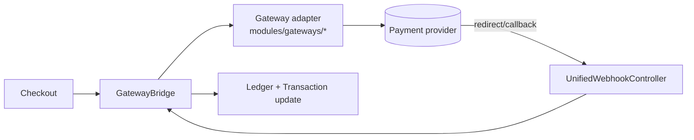

A developer's guide to how **OwnPay** is built - for contributors and integrators.

OwnPay is a **self-hosted, single-owner, multi-brand payment orchestrator** written in modern PHP (8.3+). One administrator runs the platform and creates multiple **brands** (stores); each brand has its own domain, gateways, customers, and ledgers, all isolated inside a single MySQL database by a `merchant_id` column. It is **not** a multi-tenant SaaS - there is no public sign-up.

> Looking to run it locally first? See **[LOCAL_SETUP.md](/resources/local-setup)**.

---

## 1. Tech stack at a glance

| Layer | Choice |
|-------|--------|
| Language | PHP 8.3+ (`declare(strict_types=1)` everywhere) |
| Persistence | MySQL 8 / MariaDB 10.4+ (PDO, prepared statements only) |
| Templating | Twig 3+ |
| Front controller | Single entry point `public/index.php` |
| DI | Custom PSR-11 container (`src/Container.php`) with reflection autowiring |
| Auth (mobile/API) | `firebase/php-jwt` |
| Frontend | Server-rendered Twig + vanilla CSS/JS (no SPA build step) |
| Dependencies | Intentionally minimal - see `composer.json` |
| Static analysis | PHPStan **level 9** |
| Tests | PHPUnit |

There is **no framework** (no Laravel/Symfony runtime). The kernel, router, container, and middleware pipeline are small, readable, first-party code under `src/`.

---

## 2. Request lifecycle

Every HTTP request flows through one front controller and the `Kernel`:


### Boot sequence (`Kernel::boot()`)

1. Load `.env` (`vlucas/phpdotenv`).
2. Build the DI container from `config/services.php`.
3. Set the timezone.
4. **Boot plugins** (`PluginLoader::boot()`) - *before* middleware, so a plugin can inject middleware via the `system.middleware.pipeline` filter.
5. Load the middleware pipeline from `config/middleware.php` and apply the plugin filter. Security-critical admin middleware is then re-asserted and cannot be removed by a plugin.
6. Fire the `system.boot` action.
7. Load routes from `config/routes/web.php` + `config/routes/api.php` (+ plugin routes).
8. Match the request, run its middleware group, dispatch the controller.
9. Send the response.
10. Fire `system.shutdown`.

If the app isn't installed yet, all requests redirect to `/install`. Error and maintenance pages are rendered by a dependency-free `ErrorPageRenderer` (`src/View/`) so they still work when Twig or the database is down.

---

## 3. Directory map

```text
ownpay/
├── public/            # Web root - index.php + static assets (only PHP file here)
├── src/               # All application code (PSR-4: OwnPay\ → src/)
│   ├── Kernel.php         # Boot + dispatch orchestrator
│   ├── Container.php      # PSR-11 DI container
│   ├── Http/              # Request, Response, Router
│   ├── Middleware/        # Auth, CSRF, CORS, rate limit, domain, security headers…
│   ├── Controller/        # Admin/, Api/, Checkout/, Page/, Webhook/, Install/
│   ├── Repository/        # Data access; BaseRepository + TenantScope trait
│   ├── Service/           # Business logic (Payment, Brand, Domain, Device, System…)
│   ├── Gateway/           # Gateway adapter interface + bridge + webhook processor
│   ├── Plugin/            # Plugin loader, registry, manifest, sandbox scanner
│   ├── Event/             # EventManager (WordPress-style actions + filters)
│   ├── Security/          # SecurityHelpers, UrlValidator (SSRF guards)…
│   ├── View/              # Twig factory, extensions, ErrorPageRenderer
│   ├── Cron/              # Scheduled jobs (queue worker, webhook retry, currency���)
│   └── Update/            # Self-update engine (download, verify, extract, migrate)
├── config/            # app.php, services.php, middleware.php, hooks.php, routes/
├── modules/           # gateways/, addons/, themes/ (one dir each, manifest.json)
├── templates/         # Twig templates (admin, checkout, error, emails…)
├── database/          # schema.sql + migrations/
├── vendor/            # vendor
└── docs/              # docs
```

---

## 4. Core subsystems

### 4.1 Dependency Injection (`src/Container.php`)
PSR-11 compliant. Services are bound explicitly in `config/services.php`; anything unbound is resolved by reflection (constructor autowiring). Supports shared singletons and transient bindings.

### 4.2 Repositories & brand isolation
Data access lives in `src/Repository/` on top of `BaseRepository`. Brand isolation is enforced **at the query level** by the `TenantScope` trait:

```php
// Scoped to the active brand (safe default)
$invoices = $this->invoiceRepo->forTenant($brandId)->paginateScoped($page, $perPage);

// Explicit global view for owner-level pages
$all = $this->invoiceRepo->forAllTenants()->paginate();
```

Every scoped entity table carries a `merchant_id` column. **Never** run a scoped query without `forTenant()` (or a deliberate `forAllTenants()`).

### 4.3 Double-entry ledger
Money movements are recorded as balanced debits/credits across `op_ledger_accounts`, `op_ledger_transactions`, and `op_ledger_entries`. Balances follow standard accounting directionality (assets/expenses increase on debit; liabilities/equity/revenue increase on credit). All monetary math uses **bcmath strings**, never floats.

### 4.4 Events & plugins
`EventManager` provides WordPress-style **actions** (`doAction`) and **filters** (`applyFilter`). Plugins live in `modules/` and register callbacks on these hooks. See the [Hooks Reference](https://learn.ownpay.org/hooks-reference) and [Plugin Developer Guide](https://learn.ownpay.org/plugin-developer-guide).

Plugins are discovered via `manifest.json`, run through a **static code scanner** (`PluginSandbox`) that denies dangerous calls (`exec`, `shell_exec`, `passthru`, `eval`, `system`, raw PDO/reflection), and only then loaded.

### 4.5 White-label custom domains *(industry first)*
OwnPay is the **first self-hosted payment platform** to support per-brand custom-domain checkout on a single installation. A brand maps its own domain (e.g. `pay.yourbrand.com`), which is DNS-verified (TXT ownership + A-record routing), then fully activated. From that point, every customer-facing URL uses the brand's domain - customers see the brand's logo, name, and colors; there is no trace of OwnPay.

`DomainMiddleware` resolves `HTTP_HOST` against the `op_domains` table, injects the `merchant_id`, and blocks `/admin/*` on custom domains. **Always** build customer-facing and gateway URLs through `DomainUrlService` (`buildCheckoutUrl()`, `buildCallbackUrl()`) - never hardcode a host.

### 4.6 Payment gateways
Gateways are plugins implementing `GatewayAdapterInterface` (`src/Gateway/`):

```php
interface GatewayAdapterInterface {
    public function slug(): string;
    public function initiate(array $params, array $credentials): array;
    public function verify(array $callbackData, array $credentials): array;
    public function verifyWebhook(string $rawBody, array $headers, array $credentials): bool;
    public function refund(string $gatewayTrxId, string $amount, array $credentials): array;
    public function supports(string $feature): bool;
    public function supportedCurrencies(): array; // [] = any currency
}
```

The `GatewayDefaults` trait supplies sane no-op defaults so an adapter only implements what it supports. At checkout, the intent currency is auto-converted to a gateway-supported currency via `CurrencyService` using `op_exchange_rates`, and the conversion audit trail is persisted in the transaction metadata.



### 4.7 Configuration & settings
Runtime settings live in `op_system_settings` (group/key/value, with an optional `merchant_id` for per-brand overrides). Access them through `EnvironmentService` / `SettingsRepository`; `EnvironmentService::get()` falls back to OS environment variables when no stored value exists. There is no separate config store.

### 4.8 Self-update
`src/Update/UpdateService.php` performs an atomic, rollback-safe update: fetch manifest → back up → enter maintenance → download (GitHub release asset) → **verify SHA-256 + RSA signature** → extract (with zip-slip guards) → run migrations → health-check → exit maintenance. The same release zip also works as a fresh-install archive.

---

## 5. Security model

OwnPay treats all external input as adversarial. Highlights a contributor must respect:

- **SQL**: prepared statements only (`Database` wrapper). No string-interpolated SQL.
- **Output**: Twig autoescaping on; never `|raw` untrusted data.
- **CSRF**: `CsrfMiddleware` on all non-API mutations; tokens via `SecurityHelpers::csrfToken()`.
- **Passwords**: Argon2id / bcrypt. **API keys**: 192-bit random, stored SHA-256-hashed, shown once.
- **AuthN/Z tiers** (see `config/middleware.php`): web sessions for admin; **Bearer API keys** (read/write scopes) for the merchant API; an **admin-scoped** Bearer key for the admin API; **JWT** for the mobile companion API.
- **Rate limiting**: `RateLimiterMiddleware`; auth-sensitive endpoints (login, 2FA, device pairing) use a strict bucket.
- **SSRF**: outbound webhooks resolve and **pin** a validated public IP (`UrlValidator::resolveSafeWebhookIp`) and never follow redirects.
- **Headers**: CSP (with per-request nonce), HSTS, `X-Frame-Options`, `X-Content-Type-Options` via `SecurityHeadersMiddleware`.
- **Secrets** (`.env`, signing keys) are never committed and never shipped in release zips.

---

## 6. API surface

Three independent API layers, each with its own middleware group and auth:

| Layer | Prefix | Auth | Defined in |
|-------|--------|------|-----------|
| Merchant REST | `/api/v1/*` | Bearer API key (read/write scopes) | `config/routes/api.php` |
| Mobile companion | `/api/mobile/v1/*` | JWT (after device pairing) | same |
| Admin API | `/api/admin/v1/*` | Bearer API key with `admin` scope (per-merchant) | same |

Formal API schema: **[docs.ownpay.org](https://docs.ownpay.org)**. Integration examples & guides: **[learn.ownpay.org](https://learn.ownpay.org)**.

---

## 7. Conventions for contributors

1. `declare(strict_types=1);` is the first line of every PHP file (no BOM).
2. Keep PHPStan at **level 9** - run `composer analyse` before pushing.
3. Money is **bcmath strings**, never floats.
4. Scoped DB access always goes through `forTenant()` / `*Scoped()`.
5. Customer/gateway URLs always go through `DomainUrlService` - never hardcode a host.
6. New gateway? Add a directory under `modules/gateways/<slug>/` with a `manifest.json` and an adapter implementing `GatewayAdapterInterface`. See the [Plugin Developer Guide](https://learn.ownpay.org/plugin-developer-guide).
7. Run the full check before a PR: `composer test && composer analyse && composer lint`.

---

**See also:** [Feature Reference →](/resources/features) for the complete list of OwnPay capabilities · [Local Setup →](/resources/local-setup) · [learn.ownpay.org](https://learn.ownpay.org) for integration guides.

---

❤️ Built by the **Community**, for the **Community**.
