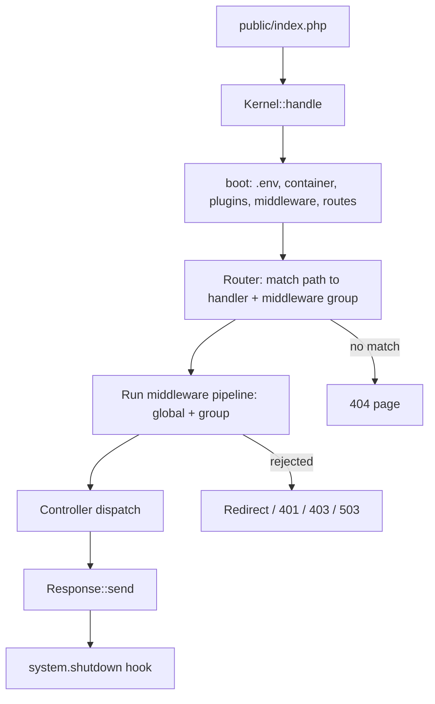

OwnPay is a **self-hosted, single-owner, multi-brand payment orchestrator** written in modern PHP (8.3+). One administrator runs the platform and creates multiple **brands** (stores); each brand has its own domain, gateways, customers, and ledgers, all isolated inside a single MySQL database by a `merchant_id` column.

## Tech stack at a glance

| Layer | Choice |
|-------|--------|
| Language | PHP 8.3+ (`declare(strict_types=1)` everywhere) |
| Persistence | MySQL 8 / MariaDB 10.4+ (PDO, prepared statements only) |
| Templating | Twig 3+ |
| Front controller | Single entry point `public/index.php` |
| DI | Custom PSR-11 container with reflection autowiring |
| Auth (mobile/API) | `firebase/php-jwt` |
| Frontend | Server-rendered Twig + vanilla CSS/JS (no SPA build step) |
| Static analysis | PHPStan **level 9** |
| Tests | PHPUnit |

There is **no framework** (no Laravel/Symfony runtime). The kernel, router, container, and middleware pipeline are small, readable, first-party code under `src/`.

## Request lifecycle



### Boot sequence

1. Load `.env` (`vlucas/phpdotenv`)
2. Build the DI container from `config/services.php`
3. Set the timezone
4. **Boot plugins** - before middleware, so plugins can inject middleware
5. Load middleware pipeline and apply plugin filter
6. Fire the `system.boot` action
7. Load routes from `config/routes/web.php` + `config/routes/api.php`
8. Match the request, run its middleware group, dispatch the controller
9. Send the response
10. Fire `system.shutdown`

## Directory map

```
ownpay/
+-- public/            # Web root - index.php + static assets
+-- src/               # All application code (PSR-4: OwnPay\ -> src/)
|   +-- Kernel.php
|   +-- Container.php
|   +-- Http/          # Request, Response, Router
|   +-- Middleware/     # Auth, CSRF, CORS, rate limit, domain, security headers
|   +-- Controller/    # Admin/, Api/, Checkout/, Page/, Webhook/, Install/
|   +-- Repository/    # Data access; BaseRepository + TenantScope trait
|   +-- Service/       # Business logic
|   +-- Gateway/       # Gateway adapter interface + bridge + webhook processor
|   +-- Plugin/        # Plugin loader, registry, manifest, sandbox scanner
|   +-- Event/         # EventManager (WordPress-style actions + filters)
|   +-- Security/      # SecurityHelpers, UrlValidator (SSRF guards)
|   +-- View/          # Twig factory, extensions, ErrorPageRenderer
|   +-- Cron/          # Scheduled jobs
|   +-- Update/        # Self-update engine
+-- config/            # app.php, services.php, middleware.php, hooks.php, routes/
+-- modules/           # gateways/, addons/, themes/ (one dir each, manifest.json)
+-- templates/         # Twig templates
+-- database/          # schema.sql + migrations/
+-- vendor/            # vendor
+-- docs/              # docs
```

## Core subsystems

### Dependency Injection

PSR-11 compliant. Services are bound explicitly in `config/services.php`; anything unbound is resolved by reflection.

### Repositories and brand isolation

Data access lives in `src/Repository/` on top of `BaseRepository`. Brand isolation is enforced at the query level by the `TenantScope` trait:

```php
$invoices = $this->invoiceRepo->forTenant($brandId)->paginateScoped($page, $perPage);
$all = $this->invoiceRepo->forAllTenants()->paginate();
```

### Double-entry ledger

Money movements are recorded as balanced debits/credits. All monetary math uses **bcmath strings**, never floats.

### Events and plugins

`EventManager` provides WordPress-style **actions** and **filters**. Plugins live in `modules/` and register callbacks on these hooks.

### White-label custom domains

OwnPay is the first self-hosted payment platform to support per-brand custom-domain checkout on a single installation.

`DomainMiddleware` resolves `HTTP_HOST` against the `op_domains` table, injects the `merchant_id`, and blocks `/admin/*` on custom domains.

### Payment gateways

Gateways are plugins implementing `GatewayAdapterInterface`. The `GatewayDefaults` trait supplies sane no-op defaults.

### Configuration and settings

Runtime settings live in `op_system_settings` (group/key/value, with optional `merchant_id` for per-brand overrides).

### Self-update

`UpdateService` performs an atomic, rollback-safe update: fetch manifest, back up, enter maintenance, download, verify SHA-256 + RSA signature, extract, run migrations, health-check, exit maintenance.

## Security model

- **SQL**: prepared statements only
- **Output**: Twig autoescaping on
- **CSRF**: `CsrfMiddleware` on all non-API mutations
- **Passwords**: Argon2id / bcrypt
- **API keys**: 192-bit random, stored SHA-256-hashed
- **Rate limiting**: `RateLimiterMiddleware`
- **SSRF**: outbound webhooks resolve and pin validated public IPs
- **Headers**: CSP (with per-request nonce), HSTS, X-Frame-Options, X-Content-Type-Options
- **Secrets** are never committed

## API surface

| Layer | Prefix | Auth |
|-------|--------|------|
| Merchant REST | `/api/v1/*` | Bearer API key |
| Mobile companion | `/api/mobile/v1/*` | JWT |
| Admin API | `/api/admin/v1/*` | Bearer API key with admin scope |

## Conventions for contributors

1. `declare(strict_types=1);` is the first line of every PHP file
2. Keep PHPStan at level 9
3. Money is bcmath strings, never floats
4. Scoped DB access always goes through `forTenant()` / `*Scoped()`
5. Customer/gateway URLs always go through `DomainUrlService`
6. Run `composer test && composer analyse && composer lint` before a PR
