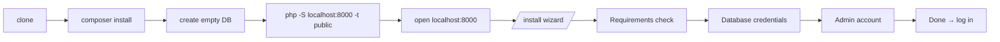

# Local Setup Guide

Get **OwnPay** running on your machine for development and contribution - on **Windows**, **macOS**, or **Linux**. The fast path below takes about **2 minutes** after the prerequisites are installed.

> New to the codebase? Read **[Architecture](./architecture)** first.

---

## Prerequisites

| Tool | Version | Why | Get it |
|------|---------|-----|--------|
| **PHP** | **8.3+** with `bcmath`, `json`, `mbstring`, `openssl`, `pdo`, `pdo_mysql`, `curl` | Runtime | [php.net/downloads](https://www.php.net/downloads) · [windows.php.net](https://windows.php.net/download/) |
| **Composer** | 2.x | PHP dependencies | [getcomposer.org/download](https://getcomposer.org/download/) |
| **MySQL** *or* **MariaDB** | MySQL 8.0+ / MariaDB 10.4+ | Database | [dev.mysql.com](https://dev.mysql.com/downloads/mysql/) · [mariadb.org](https://mariadb.org/download/) |
| **Git** | any | Clone the repo | [git-scm.com/downloads](https://git-scm.com/downloads) |
| **Node.js** *(optional)* | 20+ | Only for JS/CSS linting | [nodejs.org](https://nodejs.org/en/download) |

> **Tip:** The all-in-one stacks below (Laragon / Herd / Docker) bundle PHP + MySQL + a web server so you don't install them separately.

Check your PHP version and extensions:

```bash
php -v
php -m
```

---

## Quick Start - all platforms (~2 minutes)

This uses PHP's built-in web server, so it works identically on Windows, macOS, and Linux. No web-server config needed.

```bash
# 1. Clone
git clone https://github.com/own-pay/OwnPay.git
cd OwnPay

# 2. Install PHP dependencies
composer install

# 3. Create an empty database (MySQL example)
mysql -u root -p -e "CREATE DATABASE ownpay CHARACTER SET utf8mb4 COLLATE utf8mb4_unicode_ci;"

# 4. Serve the public/ directory
php -S localhost:8000 -t public
```

Now open **`http://localhost:8000`** in your browser. You'll be redirected to the **`/install` wizard** - it generates your `.env`, imports the schema, and creates your admin account for you. No manual `.env` editing required.



> The installer writes a lock file at `storage/.installed`. To re-run the installer, delete that file (and drop/recreate the DB).

---

## Platform-specific all-in-one stacks

Prefer a real web server and pretty `*.test` domains? Use a bundled stack. The Quick Start still applies - just point the stack's web root at `public/`.

### 🪟 Windows - Laragon (recommended)

[Laragon](https://laragon.org/download/) bundles PHP, MySQL, Apache/Nginx, and auto-creates `.test` domains.

1. Install Laragon and start it (**Start All**).
2. Make sure the bundled PHP is **8.3+** (Menu → PHP → Version). Switch if needed.
3. Put the project in Laragon's `www` folder: `C:\laragon\www\ownpay`.
4. Laragon auto-creates the vhost **`http://ownpay.test`** (Menu → **Reload**/**Restart All** if it doesn't appear).
5. Create the database in **HeidiSQL** (bundled) or run the `CREATE DATABASE` command above.
6. Visit **<http://ownpay.test>** → the installer wizard runs.

> Laragon's document root maps to the project's `public/` automatically via the bundled rewrite rules.

### 🍎 macOS - Laravel Herd (recommended)

[Herd](https://herd.laravel.com/) is a free, one-click PHP environment (PHP + Nginx + dnsmasq for `.test` domains).

1. Install Herd. It ships PHP 8.3+ and Composer.
2. Add the folder that contains the project as a **Parked** path (Herd → Settings → General), or `herd park` from the parent directory.
3. Herd serves it at **`https://ownpay.test`** (Herd points the site at `public/` automatically).
4. Start MySQL with [DBngin](https://dbngin.com/) (free) or Homebrew (`brew install mysql && brew services start mysql`), then create the `ownpay` database.
5. Visit **<https://ownpay.test>** → the installer wizard runs.

Homebrew-only alternative: `brew install php@8.3 composer mysql` then use the **Quick Start** built-in-server path.

### 🐧 Linux - native packages

```bash
# Debian / Ubuntu
sudo apt update
sudo apt install -y php8.3-cli php8.3-mysql php8.3-mbstring php8.3-bcmath \
                    php8.3-curl php8.3-xml unzip mariadb-server composer

sudo systemctl start mariadb
sudo mysql -e "CREATE DATABASE ownpay CHARACTER SET utf8mb4 COLLATE utf8mb4_unicode_ci;"

git clone https://github.com/own-pay/OwnPay.git && cd OwnPay
composer install
php -S localhost:8000 -t public
```

(Fedora: `sudo dnf install php-cli php-mysqlnd php-mbstring php-bcmath php-json composer mariadb-server`.)

For a production-like Nginx/Apache vhost, point the document root at `public/` and route all requests to `public/index.php` (an Apache `.htaccess` is already included; an `nginx.conf.example` ships in the repo root).

---

## After install - verify your setup

Run the same checks CI does:

```bash
composer test       # PHPUnit
composer analyse    # PHPStan (level 9)
composer lint       # Twig + JS + CSS lint  (Node required for js/css)
```

All three should pass on a clean checkout.

---

## Optional: local payment-gateway callbacks

External gateways (bKash, Stripe, etc.) can't reach `localhost`/`*.test`. To test real redirects/webhooks, expose your local server with a tunnel and set `GATEWAY_CALLBACK_URL` in `.env`:

```bash
# example with ngrok (https://ngrok.com/download)
ngrok http 8000
# then in .env:  GATEWAY_CALLBACK_URL=https://<your-id>.ngrok-free.app
```

---

## Troubleshooting

| Symptom | Fix |
|---------|-----|
| `/install` says an extension is missing | Install the listed `php-*` extension and restart the server. Re-check with `php -m`. |
| `composer install` fails on `ext-*` | Your CLI PHP lacks an extension. Install it (e.g. `php8.3-bcmath`) - note the **CLI** php.ini may differ from the web one. |
| "Could not connect to database" in the wizard | Confirm MySQL is running and the DB exists; on macOS/Linux the default user is often `root` with an empty or socket password. |
| Blank page / 500 with no detail | Set `APP_DEBUG=true` in `.env` for a detailed dev error page (never in production), check `storage/logs/`. |
| Installer keeps redirecting after completion | Delete `storage/.installed` only if you intend to reinstall; otherwise clear `storage/cache/`. |
| Permissions errors writing `.env`/`storage/` | Ensure the project root and `storage/` are writable by your user / the web-server user. |

---

## Project layout & where to start

See **[ARCHITECTURE.md](./architecture.md)** for the full map. Most contributions touch:

- `src/Controller/` - HTTP handlers
- `src/Service/` - business logic
- `src/Repository/` - data access
- `modules/gateways/` - payment integrations (see the [Plugin Developer Guide](/developer/plugin-types/gateway-development))
- `templates/` - Twig views

Happy hacking! 🚀


## Production Deployment

**From development to production:**

1. Test thoroughly locally
2. Push to staging environment
3. Run full test suite on staging
4. Verify backups work
5. Deploy to production
6. Monitor logs and metrics

[Full deployment guide →](/advanced-topics/performance-scaling)

## Common Development Tasks

### Add New Payment Gateway

1. Create plugin directory: `plugins/gateway-mygateway/`
2. Implement gateway interface
3. Register in plugin loader
4. Add configuration UI
5. Test with test credentials
6. Document

[Gateway development guide →](/developer/plugin-types/gateway-development)

### Create Custom Theme

1. Create theme directory: `plugins/theme-mytheme/`
2. Copy default templates
3. Customize HTML/CSS
4. Test all pages
5. Package as plugin

### Add Webhook Event

1. Define event class
2. Trigger in service
3. Register in event map
4. Test webhook delivery
5. Document event

## Summary

**Development setup:**
- ✅ Docker (recommended, fastest)
- ✅ XAMPP/LAMP (alternative)
- ✅ Linux servers (full control)

**Key commands:**
- `docker-compose up` - Start containers
- `composer install` - Install PHP deps
- `npm install` - Install frontend deps
- `php public/index.php migrate` - Setup database
- `npm run dev` - Watch frontend changes
- `vendor/bin/phpunit` - Run tests

Everything you need to develop OwnPay locally. Happy coding!
