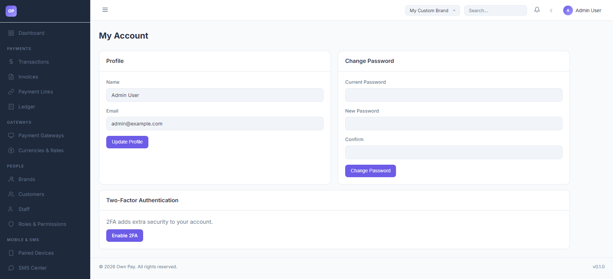
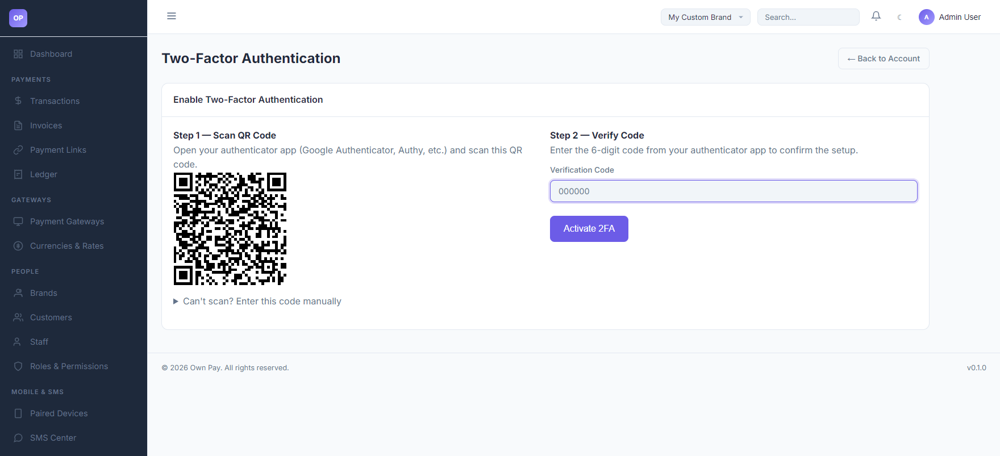

# My Account

> **Purpose:** Manage personal profile details, update passwords, and secure your account using Multi-Factor Authentication (2FA).

---

## Overview

The My Account settings page allows administrators and staff to update their display names, registered email addresses, and passwords. It also acts as the control panel for securing administrative access using RFC 6238-compliant Two-Factor Authentication (TOTP).

---

## Getting Here

To access your personal account settings:

1. Log in to the OwnPay admin dashboard.
2. In the top navbar or the left sidebar navigation footer, click on your profile name.
3. Select **My Account** or **Account Settings** from the dropdown menu.

---

## Page Sections

The Account Settings page consists of the following sections:

### 1. Profile Information

Update your basic identification details:

* **Name:** Your visual display name used throughout the platform audit logs.
* **Email:** Your email address used for login and password resets.
* **Update Profile:** Saves the profile edits.

### 2. Update Password

Securely rotate your access credentials:\

* **Current Password:** Required to authenticate changes.
* **New Password:** Must be at least 8 characters.
* **Confirm Password:** Must match the new password.
* **Update Password:** Verifies and saves the new credentials, automatically logging out active sessions to enforce re-login.

### 3. Two-Factor Authentication (2FA) Setup

Enforce multi-factor verification:

* **Status Badge:** Shows `Enabled` (green) or `Disabled` (red).
* **Setup/Manage 2FA Button:** Redirects to the two-factor authentication setup subpage.
* **QR Code & Secret (Setup screen):** Authenticator app sync targets.
* **Verification Code (Setup screen):** Six-digit input to confirm successful app sync.

---

## Fields & Options Reference

### Profile Settings Reference

| Field Name | Type | Required? | Example / Default | Description |
|---|---|---|---|---|
| **Name** | Text Input | Yes | John Doe | Administrator display name. |
| **Email** | Text Input | Yes | admin@example.com | Registered email address used for dashboard login. |

### Password Rotation Reference

| Field Name | Type | Required? | Example / Default | Description |
|---|---|---|---|---|
| **Current Password** | Password Input | Yes | ••••••••• | Existing password to authenticate changes. |
| **New Password** | Password Input | Yes | ••••••••• | New password (minimum 8 characters). |
| **Confirm Password** | Password Input | Yes | ••••••••• | Repeat the new password to confirm. |

---

## Step-by-Step: How to Use This Page

### Updating Your Name or Email
1. Navigate to **My Account**.
2. Edit the **Name** or **Email** textboxes.
3. Click the **Update Profile** button.
4. A success flash message will confirm the details have been saved.

### Changing Your Password
1. Scroll down to the **Update Password** section.
2. Enter your **Current Password**.
3. Type a strong, unique **New Password** (at least 8 characters, combining uppercase, lowercase, numbers, and symbols).
4. Re-type the new password in the **Confirm Password** field.
5. Click **Update Password**.
6. The system will update your password, log you out of your current session, and redirect you to the login screen to sign in with your new credentials.

### Enabling Two-Factor Authentication (2FA)
1. On the **My Account** dashboard, click **Manage 2FA** (or click Setup 2FA).
2. The Two-Factor Setup screen will display a QR code and a backup text secret.
3. Open your mobile authenticator app (e.g. Google Authenticator, Authy, Aegis, Bitwarden).
4. Scan the QR code, or manually input the backup text secret.
5. Once your authenticator app begins generating 6-digit codes, enter the active code in the **Verification Code** field in OwnPay.
6. Click **Enable 2FA**.
7. Upon validation, the status updates to `✓ Enabled`. Future login attempts will require entering your email, password, and the rolling 2FA code.

### Disabling Two-Factor Authentication (2FA)
1. On the **My Account** dashboard, click **Manage 2FA** (or click Disable 2FA).
2. Scroll to the disable section.
3. Enter your current account password in the confirmation field to verify identity.
4. Click **Disable 2FA**.
5. The system will remove your 2FA configurations.

---

## Configuration Guide

* **Secure Key Storage:**
  * OwnPay utilizes secure encryption wrappers for sensitive account parameters. User passwords are hashed with `Argon2id` using high-iteration variables.
  * TOTP secrets (`totp_secret_enc` in the `op_merchant_users` table) are stored utilizing `AES-256-GCM` encryption.
* **TOTP Drift Window:**
  * OwnPay validates OTP codes with a drift allowance window of `1` (allowing codes +/- 30 seconds from current server time to compensate for slight device time mismatches).

---

## Best Practices

- ✅ **Do:** Enable 2FA immediately on all administrative and staff profiles.
- ✅ **Do:** Write down and store the 2FA backup text secret in a secure physical location or password vault before enabling.
- ❌ **Don't:** Share your password or 2FA secrets with anyone, including support staff.
- ❌ **Don't:** Disable 2FA unless transferring the profile to a new authenticator device.

---

## Must Do

> [!IMPORTANT]
> If a staff member or administrator loses access to their authenticator device and is locked out, the super-administrator must clear the user's `two_factor_enabled` and `totp_secret_enc` values in the database, or reset their account via the **Staff** settings menu.

---

## Related Pages

- [Staff](../people/staff.md) — Create and manage administrator and team profiles.
- [Roles & Permissions](../people/roles.md) — Assign specific permission matrices to staff accounts.

---

## Notes

* 2FA verification attempts enforce rate-limiting rules to block brute-force guessing attacks.
