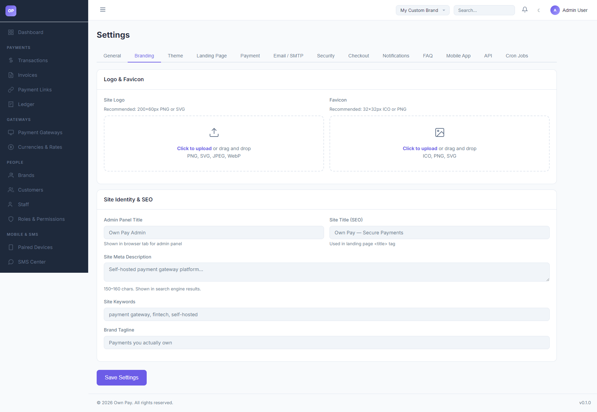

# Branding Settings

> **Purpose:** Customize the administrative title, upload global logos and favicons, and manage site identity settings.

---

## Overview

The Branding Settings tab controls the default visual identity of your OwnPay administrative panel. It allows you to configure browser tab titles, upload logo assets for the dashboard, set custom favicon files, and adjust SEO keywords and taglines for search indexing.

---

## Getting Here

To access the Branding Settings:
1. Log in to the OwnPay admin dashboard as the super-administrator.
2. Under the **SYSTEM** section in the left sidebar, click **Settings**.
3. Under the **Settings** header tabs, click **Branding**.

---

## Page Sections

The Branding Settings panel is split into two sections:

### 1. Logo & Favicon Uploads
* **Site Logo:** Upload a custom logo displayed in the header. Recommended: `200×60px` in PNG or SVG formats.
* **Favicon:** Upload the browser address bar icon. Recommended: `32×32px` in ICO or PNG formats.

### 2. Site Identity & SEO
* **Admin Panel Title:** Sets the browser tab title text when viewing the administration dashboard.
* **Site Title (SEO):** Used in the `<title>` tag on the public landing page.
* **Site Meta Description:** Short descriptive summary (150-160 characters) shown under search results.
* **Site Keywords:** Comma-separated search keyword terms.
* **Brand Tagline:** Visual slogan shown on public pages.

---

## Fields & Options Reference

### Branding Fields Reference
| Setting Name | Input Type | Example / Format | Description |
|---|---|---|---|
| **Site Logo** | File Upload | PNG, SVG, JPEG, WebP | Main dashboard header visual brand logo. |
| **Favicon** | File Upload | ICO, PNG, SVG | Small icon shown in browser tab headers. |
| **Admin Panel Title** | Text Input | Own Pay Admin | Browser title for administrative views. |
| **Site Title (SEO)** | Text Input | Own Pay - Secure Payments | Browser title for public landing views. |
| **Site Meta Description** | Text Area | Self-hosted payment gateway... | Description shown in search engine results. |
| **Site Keywords** | Text Input | payment gateway, fintech | Meta keywords index. |
| **Brand Tagline** | Text Input | Payments you actually own | Visual brand tagline. |

---

## Step-by-Step: How to Use This Page

### Uploading a Custom Logo
1. Navigate to **SYSTEM → Settings → Branding**.
2. Click the **Site Logo** drag-and-drop file upload box.
3. Select your brand logo file (e.g. `logo.png`).
4. Click **Save Settings** in the footer to upload and apply the asset.

### Adjusting SEO Metadata
1. Scroll down to the **Site Identity & SEO** section.
2. Update the **Site Title (SEO)** and **Site Meta Description** to describe your company.
3. Click **Save Settings**.

---

## Configuration Guide

* **Logo Path Resolution:**
  * Globally configured branding assets are written to the database under the `branding` group key.
  * These values are automatically loaded across the admin panel unless a brand-specific context (with its own custom logo) overrides them.

---

## Best Practices

- ✅ **Do:** Use transparent PNG or SVG vector files for the **Site Logo** to ensure it displays correctly in both light and dark display modes.
- ✅ **Do:** Keep the **Site Meta Description** between 150 and 160 characters to optimize search engine snippet previews.
- ❌ **Don't:** Upload large image files (e.g. over 1MB) for the logo or favicon, as they will slow down page load times.

---

## Related Pages

- [Landing Page Settings](./landing-page.md) - Manage hero text and FAQ cards.
- [Themes](./themes.md) - Choose visual templates for checkouts.
- [System Settings](../system/settings.md) - General site configurations.
