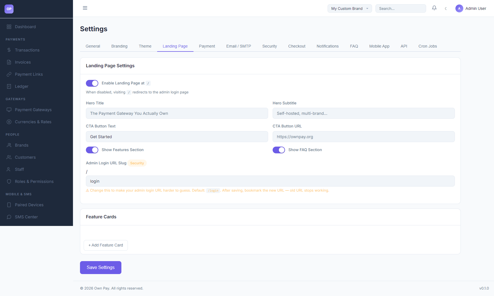

# Landing Page Settings

> **Purpose:** Configure public home screen components, hero CTA buttons, feature cards, and modify the secure admin login path.

---

## Overview

The Landing Page settings tab manages the visibility and content of your platform's public-facing landing page (the root `/` URL), and contains critical security controls like the **Admin Login URL Slug** to hide your administrative login entrance.

---

## Getting Here

To access the Landing Page Settings:
1. Log in to the OwnPay admin dashboard as the super-administrator.
2. Under the **SYSTEM** section in the left sidebar, click **Settings**.
3. Under the **Settings** header tabs, click **Landing Page**.

---

## Page Sections

The Landing Page settings dashboard is divided into three key panels:

### 1. General Page Settings
* **Enable Landing Page:** Toggle whether visiting the root URL `/` displays the marketing landing page. When disabled, visiting `/` redirects users directly to the admin login view.

### 2. Marketing Content
* **Hero Title / Subtitle:** Large banner text shown at the top of the landing page.
* **CTA Button Text / URL:** Call-to-action button settings (e.g. "Get Started" pointing to registration or docs).
* **Show Features / FAQ Sections:** Toggles to enable or hide modular content sections.
* **Feature Cards Builder:** Click **+ Add Feature Card** to append custom feature details (title, description, icon) to the landing page layout.

### 3. Security Credentials
* **Admin Login URL Slug:** Allows you to change the URL path used to access the admin portal (default is `login`, e.g. `https://ownpay.test/login`).

---

## Fields & Options Reference

### Landing Page Fields Reference
| Field Name | Type | Default | Description |
|---|---|---|---|
| **Enable Landing Page** | Toggle | Enabled | Set public root view behavior. |
| **Hero Title** | Text Input | The Payment Gateway... | Big marketing headline. |
| **Hero Subtitle** | Text Input | Self-hosted, multi-brand... | Explanatory tagline. |
| **CTA Button Text** | Text Input | Get Started | Call-to-action label. |
| **CTA Button URL** | Text Input | https://ownpay.org | Redirect target for the CTA button. |
| **Login URL Slug** | Text Input | login | Secure path used to enter the admin panel (e.g. `/secret-login`). |

---

## Step-by-Step: How to Use This Page

### Masking the Admin Login URL
1. Navigate to the **Landing Page** settings tab.
2. Scroll to the **Admin Login URL Slug** input box.
3. Replace `login` with a secure, hard-to-guess slug (e.g. `op-admin-portal-2026`).
4. Click **Save Settings** in the footer.
5. **⚠️ MUST DO:** Immediately bookmark the new URL (`https://yourdomain.com/op-admin-portal-2026`). The default `/login` route will now return a **404 Not Found** page to mask the admin interface.

### Adding a Feature Card
1. Under **Feature Cards**, click **+ Add Feature Card**.
2. Enter a title (e.g., "SMS Auto-Verification") and description.
3. Select an icon class or label.
4. Click **Save Settings** to publish the section.

---

## Best Practices

- ✅ **Do:** Change the **Admin Login URL Slug** in production to prevent automated bots from finding your login portal.
- ✅ **Do:** Keep the Landing Page enabled if you intend to distribute public payment links, as it provides a professional home page layout.
- ❌ **Don't:** Forget your custom login slug. If lost, you will need to manually inspect the `op_system_settings` database table to retrieve it.

---

## Must Do

> ⚠️ The Admin Login URL Slug must only contain lowercase letters, numbers, and hyphens. Spaces, capitals, or special characters (like `@` or `+`) are blocked by route parameter constraint filters and will crash the router.

---

## Related Pages

- [Branding Settings](./branding-settings.md) — Customize SEO titles and company logos.
- [System Settings](../system/settings.md) — Manage timezones and base URL parameters.
- [Domains](../system/domains.md) — Setup custom white-label hostnames.
