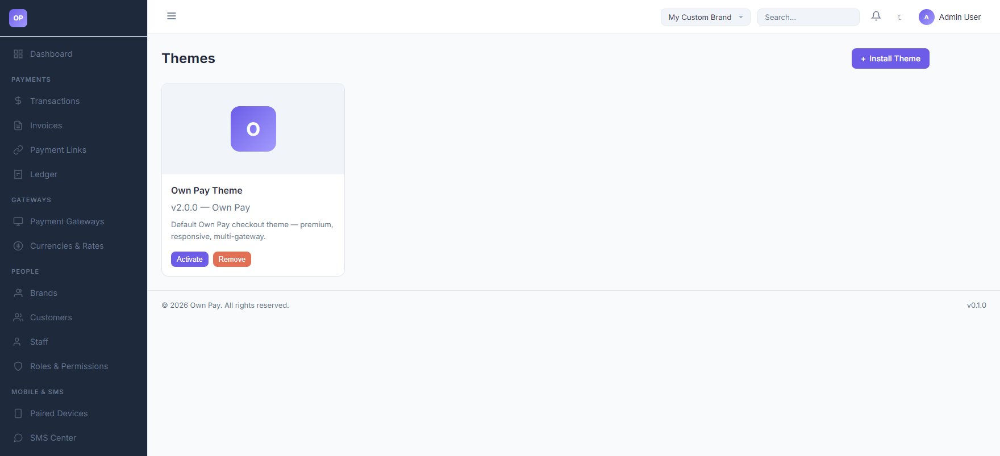

# Themes

> **Purpose:** Select visual themes, activate checkout template structures, and upload custom stylesheets.

---

## Overview

The Themes page manages the HTML/CSS template envelopes used to render customer-facing checkout interfaces (`/checkout/{token}`) and payment link sheets (`/pay/{slug}`). OwnPay supports modular theme plugins that change layouts, animations, and input patterns.

---

## Getting Here

To access the Themes manager:
1. Log in to the OwnPay admin dashboard.
2. Under the **APPEARANCE** section in the left sidebar, click **Themes**.

---

## Page Sections

The Themes dashboard displays:

### 1. Active Theme Cards
Cards displaying details for each theme package discovered on the file system:
* **Theme Name:** The display title (e.g. `Own Pay Theme`).
* **Version & Author:** Package version and developer credits (e.g. `v2.0.0 - Own Pay`).
* **Description:** Details outlining features of the theme (e.g. "Default Own Pay checkout theme - premium, responsive, multi-gateway").
* **Controls:** Click **Activate** to make this the active global checkout theme, or **Remove** to delete the files from the server.

### 2. Install Theme
Located at the top header by clicking the **+ Install Theme** link:
* Allows administrators to upload a packaged `.zip` theme archive directly to the server.

---

## Step-by-Step: How to Use This Page

### Activating a Theme
1. Navigate to the **Themes** dashboard.
2. Find the target theme card.
3. Click the **Activate** button.
4. The system will update your visual settings. Any active checkout sessions will load this layout structure instantly.

---

## Configuration Guide

* **Theme Slug Mapping:**
  * System settings save the active theme identifier in database settings as `active_theme`.
  * The default theme has a manifest slug of `own-pay`.
  * Visual assets (logos, favicons, custom colors) configured under **Branding Settings** or brand contexts are injected into Twig templates dynamically.

---

## Best Practices

- ✅ **Do:** Test custom themes on desktop and mobile browsers to ensure input fields (like the card or phone number boxes) remain accessible.
- ✅ **Do:** Keep the default `own-pay` theme installed as a fallback.
- ❌ **Don't:** Delete an active theme. Always activate an alternative template first.
- ❌ **Don't:** Upload unverified zip archives as they could contain malicious code.

---

## Related Pages

- [Branding Settings](./branding-settings.md) - Customize logo assets.
- [Landing Page Settings](./landing-page.md) - Modify public home text blocks.
- [Payment Gateways](../gateways/gateways.md) - Configure manual and API payment rules.
