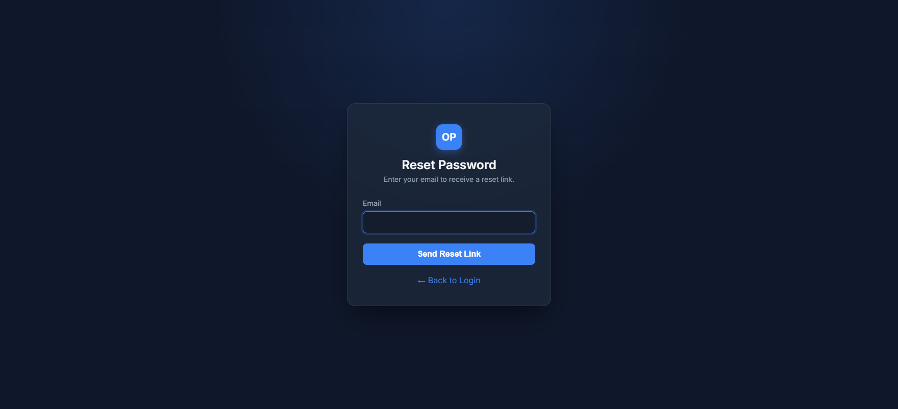
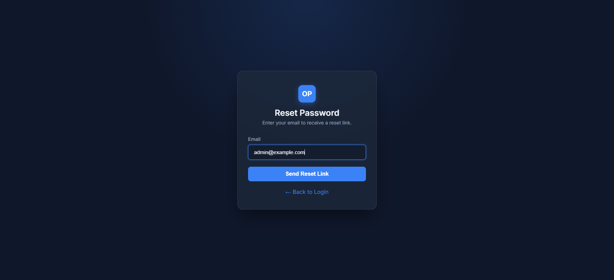
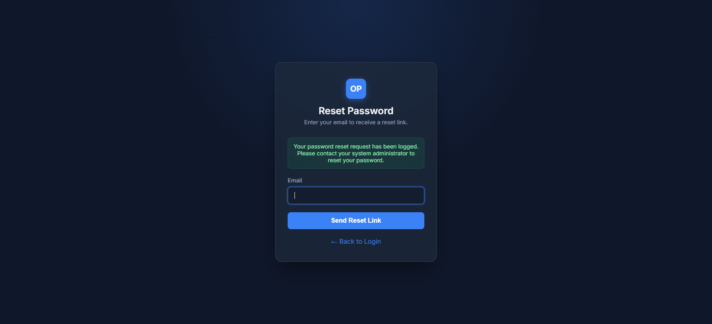

# Forgot Password

> **Purpose:** Interface to log a password reset request and get instructions to recover account access.

---

## Overview

In a sovereign payment gateway setup like OwnPay, password resets do not automatically send email reset links by default to prevent unauthorized email phishing and coordinate security. Instead, clicking the recovery link logs your request in the system audit trail, and advises you to coordinate with the system super-administrator.

---

## Getting Here

To get to this page:
1. Navigate to the login page (`https://your-domain.com/login`).
2. Click the **Forgot password?** link next to the "Remember me" checkbox.

---

## Page Sections

The recovery interface is simple:

### Reset Request Box

Contains the email address field to request recovery and instructions.

---

## Fields & Options Reference

| Field / Option | Type | Required? | Default | Description |
|---|---|---|---|---|
| **Email** | Text / Email | Yes | — | Enter the registered email address of the account you want to recover. |
| **Send Reset Link** | Button | Yes | — | Submits the request and registers the recovery entry. |
| **← Back to Login** | Link | No | — | Navigates back to the main login form. |

---

## Step-by-Step: How to Use This Page

1. Enter your registered email in the **Email** field.
2. Click the **Send Reset Link** button.
3. You will see a notification stating: *"Your password reset request has been logged. Please contact your system administrator to reset your password."*
4. Contact your super-administrator to have them manually reset your password in the Staff settings page.

---

## Configuration Guide

* **Audit Tracking:** When a password reset is submitted, an audit log entry of type `password_reset.requested` is written to the system database. The super-administrator can see this in the **Audit Log** section to verify the request is legitimate.
* **Support Email:** The support contact email shown on this page is pulled from the system settings under **General Settings → Support Email**.

---

## Best Practices

- ✅ **Do:** Verify the exact spelling of your registered email.
- ✅ **Do:** Coordinate with your super-administrator via a secure channel (e.g. secure corporate chat or in-person) to confirm you initiated the request.
- ❌ **Don't:** Submit multiple requests consecutively; this will clutter the audit log and trigger rate limiting.
- ❌ **Don't:** Rely on automated reset emails in high-security gateway environments.

---

## Must Do

> ⚠️ Contact your super-administrator directly after submitting the form. The system will NOT send an automated email to prevent token hijacking.

---

## Optional / Can Skip

> _Not applicable for this page._

---

## Common Mistakes & Troubleshooting

| Symptom | Likely Cause | Fix |
|---|---|---|
| Error: `Please enter your email address` | Field was submitted empty. | Enter your registered email address and try again. |
| No email arrives after clicking submit | The system does not send emails for recovery; it logs it for administrator review. | Contact your system administrator to reset the password manually in the admin panel. |

---

## Related Pages

- [Login](./login.md) — The main login form.
