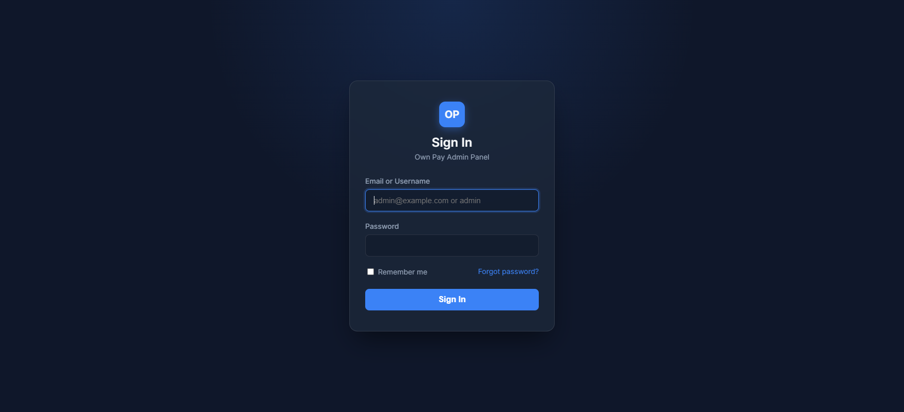
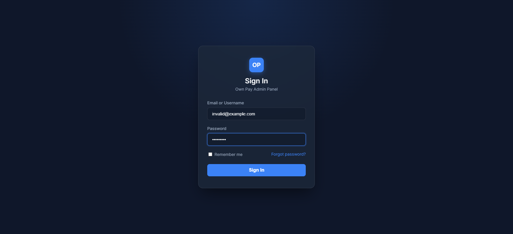

# Login

> **Purpose:** Secure entrance gateway for super-administrators and authorized staff members to access the OwnPay admin panel.

---

## Overview

The Login page is the primary security gate of the OwnPay platform. To prevent unauthorized access to sensitive financial ledger data, only pre-registered staff members and the super-administrator can sign in. The page supports brute-force lockout protections and secure session management.

---

## Getting Here

To access the login page:
1. Open your web browser.
2. Navigate to your master OwnPay domain followed by the login slug: `https://your-domain.com/login` (Note: The default slug is `login`, but this can be customized in the Landing Page settings for additional security).

---

## Page Sections

The login interface consists of a single focused container:

### Sign In Box

Contains fields to input your administrative credentials, a toggle to stay signed in, and links to recover forgotten credentials.

---

## Fields & Options Reference

| Field / Option | Type | Required? | Default | Description |
|---|---|---|---|---|
| **Email or Username** | Text | Yes | - | The pre-registered email address or username associated with your user account. |
| **Password** | Password | Yes | - | The secure password associated with your account. Case-sensitive. |
| **Remember me** | Toggle / Checkbox | No | Unchecked | Keeps your session active for a longer duration so you do not have to log in repeatedly. |
| **Sign In** | Button | Yes | - | Submits your credentials to verify and logs you into the dashboard. |
| **Forgot password?** | Link | No | - | Redirects you to the password recovery request instructions page. |

---

## Step-by-Step: How to Use This Page

1. Enter your registered email address or username in the **Email or Username** field.
2. Input your secure password in the **Password** field.
3. (Optional) Check the **Remember me** box if you are logging in from a private, trusted device.
4. Click the **Sign In** button.
5. If Two-Factor Authentication (2FA) is enabled on your account, you will be redirected to the 2FA entry screen. Otherwise, you will land directly on the **Dashboard**.

---

## Configuration Guide

The path and access rules of the login screen can be customized by the super-administrator:
* **Admin Login URL Slug:** You can change the route from `/login` to a customized slug (e.g. `/secure-gate-7x2`) under the Landing Page Settings. If changed, any attempt to access the old `/login` URL will return a **404 Not Found** page.
* **Brute-Force Lockout:** After five (5) failed login attempts within a 5-minute window, the account is temporarily locked. The lockout duration is 5 minutes before you can try again.

---

## Best Practices

- ✅ **Do:** Change the default `/login` slug to a random, hard-to-guess word to mask the admin panel from automated bot scanners.
- ✅ **Do:** Only check the **Remember me** option on personal, fully encrypted devices.
- ❌ **Don't:** Share login credentials among staff members. Always create dedicated staff accounts with role-based permissions.
- ❌ **Don't:** Attempt to log in over a public, unencrypted HTTP connection. Ensure the address begins with `https://`.

---

## Must Do

> ⚠️ Always ensure that the browser address bar displays the correct domain name and a secure lock icon (SSL/TLS active) before entering your credentials.

---

## Optional / Can Skip

- **Remember me** is entirely optional and can be left unchecked for normal security compliance.

---

## Common Mistakes & Troubleshooting

| Symptom | Likely Cause | Fix |
|---|---|---|
| `Invalid credentials` error message | Typo in email/username or password. | Re-verify your credentials and type them carefully. Note that passwords are case-sensitive. |
| `Account temporarily locked` error | Too many incorrect login attempts in a short timeframe. | Wait 5 minutes for the lockout window to expire, then try again. |
| `404 Not Found` when visiting `/login` | The admin login slug has been changed by the super-administrator. | Access the admin panel using the custom slug configured in your settings. |

---

## Related Pages

- [Forgot Password](./forgot-password.md) - Request password reset instructions.
- [Two-Factor Authentication](./two-factor.md) - The next step in the login flow if 2FA is active.
