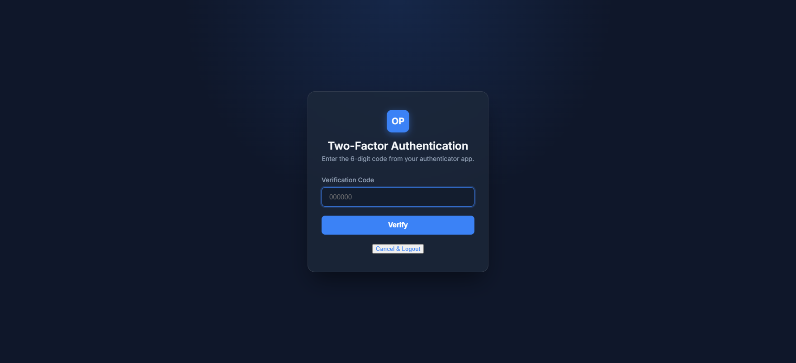

# Two-Factor Authentication (2FA)

> **Purpose:** Verification screen to enter the 6-digit TOTP code when 2FA is enabled on an account.

---

## Overview

If Two-Factor Authentication (2FA) is enabled for your account, the login flow requires you to verify your identity using a mobile authenticator app (such as Google Authenticator, Authy, or Bitwarden) after entering your correct email and password. This screen receives the 6-digit verification code.

---

## Getting Here

To get to this page:
1. Navigate to the login page and enter your correct **Email or Username** and **Password**.
2. Click **Sign In**.
3. If 2FA is active, you will be redirected automatically to `/2fa`.

---

## Page Sections

The 2FA page consists of a single verification form:

### Verification Box

Contains the field to input the 6-digit code, the verification submission action, and the cancel option.

---

## Fields & Options Reference

| Field / Option | Type | Required? | Default | Description |
|---|---|---|---|---|
| **Verification Code** | Text / Numeric | Yes | — | The 6-digit code generated by your authenticator application. |
| **Verify** | Button | Yes | — | Submits and verifies the entered code to complete your login session. |
| **Cancel & Logout** | Button / Link | No | — | Cancels the login process and logs you out completely, returning to the login page. |

---

## Step-by-Step: How to Use This Page

1. Open your authenticator app on your mobile device.
2. Locate the entry for **OwnPay** (which maps to your login email).
3. Copy or read the current active 6-digit numeric code.
4. Enter the code in the **Verification Code** field on the screen.
5. Click **Verify**.
6. Upon successful verification, you will be logged in and redirected to the **Dashboard**.

---

## Configuration Guide

* **Clock Drift Tollerance:** The system allows up to 60 seconds (2 time slices) of clock drift between your mobile device and the server.
* **Replay Protection:** A code cannot be used more than once. The system tracks the last used time slice window and rejects duplicate submissions to prevent session hijacking.
* **Rate Limiting:** Entering too many incorrect codes will result in your session hitting the rate limiter, locking you out from further attempts for 5 minutes.

---

## Best Practices

- ✅ **Do:** Synchronize the time on your mobile device to ensure the codes generated match the server's time precisely.
- ✅ **Do:** Click **Cancel & Logout** if you are logging in from a public computer and cannot complete the 2FA step.
- ❌ **Don't:** Share your 2FA secret key or authenticator app entries with anyone.
- ❌ **Don't:** Expose your backup recovery keys to unauthorized users.

---

## Must Do

> ⚠️ You must submit the code within its 30-second validity window. If the timer in your authenticator app expires and shows a new code, type the new code instead.

---

## Optional / Can Skip

> _Not applicable for this page._

---

## Common Mistakes & Troubleshooting

| Symptom | Likely Cause | Fix |
|---|---|---|
| `Invalid or expired 2FA code` error | Your mobile device clock is out of sync, or the code has expired. | Verify that your phone's time settings are set to automatic. If it still fails, wait for the next 30-second code to generate in the app and type it quickly. |
| `2FA secret could not be decrypted` error | System decryption key mismatch. | Contact your system administrator to revoke and re-enable 2FA on your account. |
| `Rate limit exceeded` error | Too many invalid submissions. | Wait 5 minutes for the rate limit window to expire, then log in again. |

---

## Related Pages

- [Login](./login.md) — The initial credentials screen.
- [My Account](../account/my-account.md) — Where to set up and enable/disable 2FA.
