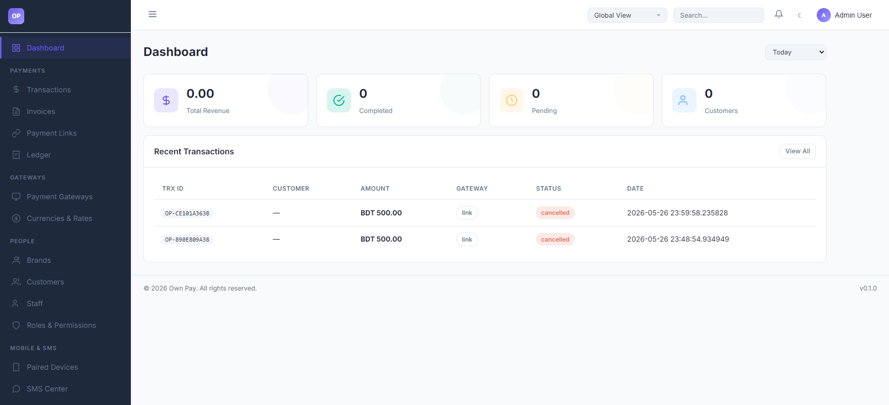

# Admin Dashboard

> **Purpose:** Command center presenting a real-time overview of transaction volumes, revenues, customer counts, and brand-wide statistics.

---

## Overview

The Admin Dashboard is the central workspace of the OwnPay platform. It displays critical business metrics, transaction trends, and quick access navigation. It supports both a global aggregated view of all brands and filtered views for specific brands or stores.

---

## Getting Here

To reach the dashboard:
1. Log in to your OwnPay account.
2. If you are already logged in and navigating other sections, click **Dashboard** at the top of the left sidebar.

---

## Page Sections

The dashboard layout is divided into three primary functional areas:

### 1. Header Navigation Bar
Located at the top of the page, this toolbar contains system controls:
* **Sidebar Toggle:** Hides or expands the main navigation sidebar.
* **Brand Context Dropdown:** Allows you to switch between **Global View** (super-administrator aggregate) and individual **Brand/Store** views.
* **Global Search:** Search transactions, customers, or invoices.
* **Theme Toggle:** Switch between Dark and Light mode themes.
* **User Menu:** Access your account settings or log out.

### 2. Key Performance Indicators (KPIs)
A row of cards displaying quick stats for the selected time range:
* **Total Revenue:** Total value of all completed transactions (converted to your base currency).
* **Completed:** Count of transactions successfully paid.
* **Pending:** Count of transactions waiting for customer payment or SMS verification.
* **Customers:** Total number of unique customers registered.

### 3. Recent Transactions List
Shows the most recent payment attempts, allowing quick verification of incoming transactions. Each entry lists:
* **TRX ID:** The system-generated unique transaction identifier.
* **Customer:** The customer name or email.
* **Amount:** The transaction amount and currency.
* **Gateway:** The gateway through which the payment was routed (e.g. bKash, Nagad, Stripe, or manual gateway link).
* **Status:** Current status of the transaction (e.g., `completed`, `pending`, `cancelled`).
* **Date:** Timestamp of the transaction.

---

## Fields & Options Reference

| Field / Option | Type | Required? | Default | Description |
|---|---|---|---|---|
| **Brand Selector** | Dropdown | Yes | Global View | Filter all dashboard cards and transaction lists to a specific brand context. |
| **Time Range Selector** | Dropdown | Yes | Today | Filter the metric cards. Options include: `Today`, `Last 7 Days`, `Last 30 Days`, and `All Time`. |
| **View All** | Link | No | - | Redirects to the complete Transactions List page. |

---

## Step-by-Step: How to Use This Page

### Filtering Metrics by Brand and Time
1. Go to the header bar and click the **Brand Selector** dropdown.
2. Select the specific brand you wish to inspect (e.g. `My Custom Brand`). All KPI cards and the recent transactions list will refresh automatically to show data only for that brand.
3. Locate the **Time Range Selector** in the main content header.
4. Select a range (e.g. **Last 30 Days**) to see performance over the past month.

### Inspecting a Recent Transaction
1. Find the transaction in the **Recent Transactions** table.
2. Click the row of the transaction.
3. The system will load the transaction details panel, where you can inspect customer payment proofs, fee breakdowns, and raw ledger entries.

---

## Configuration Guide

* **Global View vs. Brand Context:**
  * **Global View** is only available to accounts with the **Super-administrator** role. It displays aggregated financial data across all registered brands.
  * **Brand Context** filters the repository queries down to a single `merchant_id`. If a staff member is assigned to a specific brand, they will only see that brand's statistics and cannot switch to other brands or the Global View.

---

## Best Practices

- ✅ **Do:** Check the **Ledger** page to verify the double-entry bookkeeping balance matches the total revenue shown on the dashboard.
- ✅ **Do:** Use the **Global View** to compare overall performance across your different white-label store domains.
- ❌ **Don't:** Leave the dashboard open on an unattended screen. Click the theme toggle to change mode if working in low-light environments, or lock your session.
- ❌ **Don't:** Ignore a high number of **Pending** transactions; check if the SMS Parser device is online and receiving notification templates.

---

## Must Do

> ⚠️ When reviewing statistics, always double-check the selected **Brand Context** in the top header. Confusing a single brand's metrics with global aggregated metrics can lead to reporting errors.

---

## Optional / Can Skip

- **Search box** and **Alerts** are supplementary tools. You can navigate the system completely using the sidebar without them.

---

## Common Mistakes & Troubleshooting

| Symptom | Likely Cause | Fix |
|---|---|---|
| Dashboard metrics show `0.00` and no transactions | The selected Brand has no transactions yet, or the Time Range is set to a period with no activity. | Switch the Time Range selector to **All Time** or check that you have selected the correct Brand Context. |
| Cannot see the "Global View" option in the dropdown | Your user account is a Staff account and does not have super-admin privileges. | Log in with a super-administrator account to view global aggregations. |

---

## Related Pages

- [Transactions](../payments/transactions.md) - View and manage the complete list of transactions.
- [Ledger](../payments/ledger.md) - Detailed double-entry financial accounts.
- [Brands](../people/brands.md) - Set up and configure brand settings.
