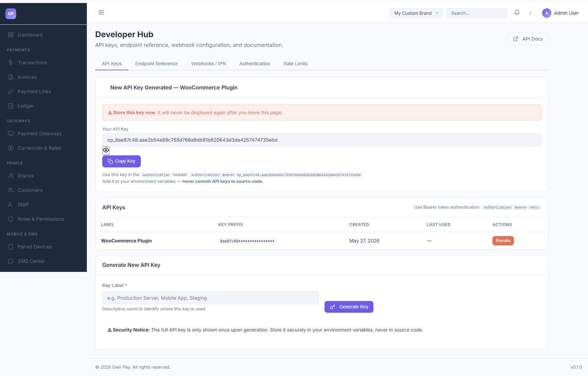

# Developer Hub

> **Purpose:** Generate integration API keys, configure outbound webhook/IPN endpoints, and manage API rate limits.

---

## Overview

The Developer Hub compiles all tools and configuration parameters needed by developers to integrate OwnPay checkout workflows directly into their websites or custom applications (e.g. WooCommerce plugins, mobile apps, or backend servers).

---

## Getting Here

To access the Developer Hub:
1. Log in to the OwnPay admin dashboard.
2. Under the **DEVELOPERS** section in the left sidebar, click **Developer Hub**.

---

## Page Sections

The Developer Hub contains the following sub-tabs:

### 1. API Keys
Manage credentials used to authenticate requests to the OwnPay REST API:
* **API Keys Table:** Lists active keys, showing their user-defined label, key prefix, creation date, and last used timestamp.
* **Generate New API Key Form:** Form to create a new key by entering a key label.
* **New Key Modal:** Displays the newly generated key prefix (e.g., `op_8ae87c48...`) only once.

### 2. Endpoint Reference
Lists key endpoint pathways exposed by the platform (e.g. `/api/v1/payment-intents`, `/api/v1/transactions`) to initiate and monitor checkouts.

### 3. Webhooks / IPN
Manage outbound webhooks (Instant Payment Notifications) sent to your server when payment events occur (like `payment.completed` or `payment.failed`).

### 4. Rate Limits
Defines rate-limit settings to prevent API abuse, setting threshold constraints on the number of requests per minute.

---

## Fields & Options Reference

### Generate API Key Fields
| Field Name | Type | Required? | Example | Description |
|---|---|---|---|---|
| **Key Label** | Text Input | Yes | WooCommerce Plugin | Identify where this key is deployed. |
| **Generate Key** | Button | Yes | — | Generates the Bearer token credentials. |

---

## Step-by-Step: How to Use This Page

### Generating a New API Key
1. Navigate to the **Developer Hub** under the **API Keys** tab.
2. Under **Generate New API Key**, type a descriptive **Key Label** (e.g. `WooCommerce Plugin`).
3. Click the **Generate Key** button.
4. The screen will refresh and display the **New API Key Generated** alert showing your full key string (e.g., `op_8ae87c48.aae2b54e89c755d768a9db81b820643d3da4257474735ebd`).
5. Click **Copy Key** and save it securely inside your website's environment variables.
6. Refreshing or leaving this page permanently conceals the key.

### Revoking an API Key
1. Find the target key label in the **API Keys** list table.
2. Click the **Revoke** button under the **ACTIONS** column.
3. Confirm the revocation dialog. The key is instantly deactivated, and any API requests utilizing that token will return a **401 Unauthorized** error.

---

## Configuration Guide

* **Bearer Authentication Headers:**
  * When executing requests to the OwnPay API, pass the key inside the HTTP headers:
    `Authorization: Bearer op_<your-key>`
  * Web Security Constraint: Never hardcode or commit keys inside public code repositories. Always read them from your server's `.env` configuration file.

---

## Best Practices

- ✅ **Do:** Copy the full API key immediately upon generation, as it is only shown once.
- ✅ **Do:** Generate separate keys for different environments (e.g. one for `Staging Server` and one for `Production Server`) to ease rotation audits.
- ❌ **Don't:** Commit raw API keys to Git repositories or paste them in open support threads.
- ❌ **Don't:** Share keys with non-developer staff.

---

## Must Do

> ⚠️ Webhooks/IPN signatures must be verified on your server. Always compare the incoming payload's HMAC signature against your webhook secret key to prevent webhook spoofing attacks.

---

## Related Pages

- [Audit Log](../reports-finance/audit-log.md) — Monitor administrative access.
- [System Settings](../system/settings.md) — Configure general server timezones.
- [Payment Gateways](../gateways/gateways.md) — Configure manual and API gateway structures.
