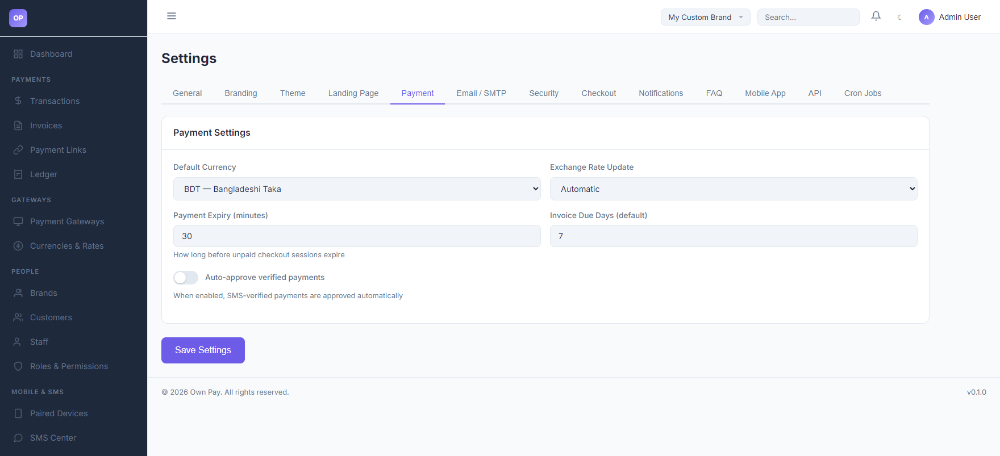

# Currencies & Rates

> **Purpose:** Set the brand default currency, configure automatic exchange rates, and manage payment session expiry durations.

---

## Overview

The Currencies & Rates settings panel controls how currency translation is handled on your checkouts, how long customers have to pay before an invoice or checkout session expires, and how transaction matching triggers automated verification workflows.

---

## Getting Here

To access the Currencies & Rates settings:
1. Log in to the OwnPay admin dashboard.
2. Under the **GATEWAYS** section in the left sidebar, click **Currencies & Rates**.

---

## Page Sections

The payment settings panel provides the following configurations:

### 1. Currency & Exchange Rates
* **Default Currency:** The base currency used to invoice customers and credit your ledger. Supported default options include:
  * `BDT - Bangladeshi Taka`
  * `USD - US Dollar`
  * `EUR - Euro`
  * `GBP - British Pound`
  * `INR - Indian Rupee`
* **Exchange Rate Update:** Choose how multi-currency checkouts calculate rates:
  * **Automatic:** Periodically updates currency conversion factors using public rates APIs.
  * **Manual:** Let's you hardcode static rates for your conversions under the settings database.

### 2. Lifecycles & Verification
* **Payment Expiry (minutes):** Defines the active lifespan (between 5 and 1440 minutes, defaulting to 30) of an unpaid checkout page. Once reached, the transaction state transitions to `cancelled` or `expired`.
* **Invoice Due Days (default):** Automatically sets the payment deadline (between 1 and 365 days, defaulting to 7) for newly generated customer invoices.
* **Auto-approve verified payments:** Toggle to authorize checkout checkups. When enabled, transactions that match an incoming parsed SMS transaction ID are completed automatically without administrative review.

---

## Fields & Options Reference

### Payment Settings Reference
| Setting Field | Type | Options / Range | Default | Description |
|---|---|---|---|---|
| **Default Currency** | Select | BDT, USD, EUR, GBP, INR | BDT | The pricing currency for checkout flows. |
| **Exchange Rate Update** | Select | Automatic, Manual | Automatic | Method of retrieving conversion rates. |
| **Payment Expiry (minutes)** | Spin Button | 5 to 1440 | 30 | Life of a checkout session before auto-cancellation. |
| **Invoice Due Days** | Spin Button | 1 to 365 | 7 | Grace period in days before invoices become overdue. |
| **Auto-approve payments** | Switch / Label | Enabled / Disabled | Enabled | Toggle SMS-matched transaction auto-completion. |

---

## Step-by-Step: How to Use This Page

### Changing Your Base Currency
1. Navigate to the **Currencies & Rates** panel.
2. Open the **Default Currency** dropdown.
3. Select your desired base currency (e.g., `USD - US Dollar`).
4. Click **Save Settings** to persist the change.

### Adjusting Checkout Session Lifespans
1. Navigate to the **Payment Expiry** number box.
2. Enter the maximum time allowed for customers to make a transfer (e.g., `45` minutes).
3. Click **Save Settings**. Any checkout links generated after this point will enforce the 45-minute timeout.

---

## Configuration Guide

* **Exchange Rates Calculations:**
  * When a customer pays in a currency different from your default store currency, the checkout calculations map the target currency amount using the rate configured here.
  * If using **Automatic** updates, make sure your cron tasks are running to fetch updated rates from the external API provider.

---

## Best Practices

- ✅ **Do:** Keep the **Payment Expiry** duration long enough for customers to navigate their banking apps (usually 15 to 30 minutes).
- ✅ **Do:** Enable **Auto-approve verified payments** if using a paired SMS parsing Android device to reduce manual auditing workloads.
- ❌ **Don't:** Change the default currency frequently, as it will affect historical reporting and ledger balances across different periods.
- ❌ **Don't:** Set invoice due days to more than 90 days unless offering custom commercial terms.

---

## Must Do

> ⚠️ Ensure the server cron job scheduler is running if you set **Exchange Rate Update** to **Automatic** to prevent stale conversion rate calculations.

---

## Optional / Can Skip

- Multi-currency configs and exchange rate update rules can be ignored if you only charge customers in your base currency.

---

## Common Mistakes & Troubleshooting

| Symptom | Likely Cause | Fix |
|---|---|---|
| Checkout page times out too fast for customers | The payment expiry duration is set too low (e.g., 5 minutes). | Increase the expiry duration to at least 15 or 30 minutes and save settings. |
| Automatic rates are not updating | Stale cache or the external exchange rates service API is blocked by system firewalls. | Switch the setting to **Manual** to override values temporarily, or check developer error logs. |

---

## Related Pages

- [Payment Gateways](./gateways.md) - Configure gateway credentials and manual wallets.
- [SMS Center](../mobile-sms/sms-templates.md) - Map notification structures for auto-approvals.
