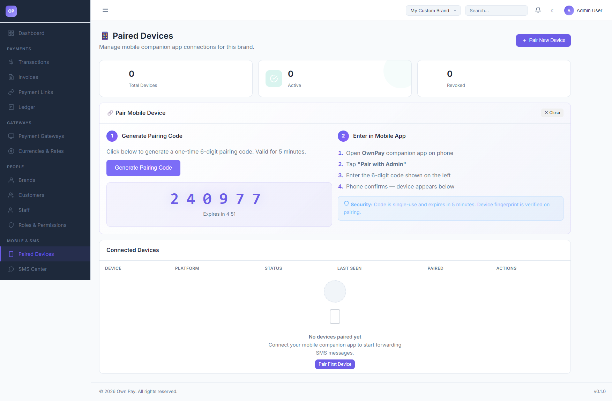

# Paired Devices

> **Purpose:** Connect Android companion devices to OwnPay using secure, temporary pairing codes to forward incoming transaction SMS alerts.

---

## Overview

The Paired Devices page manages connection states between the OwnPay administrative server and your physical mobile devices running the OwnPay Android Companion App. Pairing mobile devices enables automatic forwarding of wallet transfer SMS (e.g. bKash, Nagad, Rocket) to your server for real-time regex parsing and transaction approval.

---

## Getting Here

To access the Paired Devices manager:
1. Log in to the OwnPay admin dashboard.
2. Under the **MOBILE & SMS** section in the left sidebar, click **Paired Devices**.

---

## Page Sections

The Paired Devices dashboard is divided into three areas:

### 1. Connection KPI Cards
Located at the top of the content view, showing status aggregates:
* **Total Devices:** Lifetime count of mobile profiles paired with this brand context.
* **Active:** Devices currently authorized and listening for incoming SMS.
* **Revoked:** Devices that had their session keys manually invalidated by an administrator.

### 2. Pair Mobile Device Wizard
The interactive connection guide:
* **Pair New Device Button:** Displays or hides the wizard panel.
* **Generate Pairing Code:** Generates a temporary 6-digit numeric token (e.g., `240977`) valid for 5 minutes.
* **Expiration Countdown:** Displays remaining time before the token invalidates.
* **App Pairing Instructions:** Walkthrough outlining how to insert the code inside the Android companion application.

### 3. Connected Devices Table
Displays all authenticated hardware:
* **DEVICE:** Device name and verified hardware fingerprint.
* **PLATFORM:** OS version (e.g., Android 13, SDK 33).
* **STATUS:** Active, Offline, or Revoked.
* **LAST SEEN:** The timestamp of the last heart-beat ping sent from the device.
* **PAIRED:** Date and time the pairing was authorized.
* **ACTIONS:** Click **Revoke** to permanently disable forwarding credentials for the device.

---

## Fields & Options Reference

### Pairing Options Reference
| Control Option | Type | Expiry | Description |
|---|---|---|---|
| **Pair New Device** | Button | — | Toggle visibility of the device pairing panel. |
| **Generate Pairing Code** | Button | — | Generates a 6-digit OTP code to insert into the mobile app. |
| **6-Digit OTP** | Output Code | 5 Minutes | The security token to type into the companion app. |
| **Revoke** | Button | Immediate | Invalidates the device's JWT token, blocking all future API calls. |

---

## Step-by-Step: How to Use This Page

### Pairing a New Android Device
1. Navigate to the **Paired Devices** page and click **Pair New Device**.
2. Click **Generate Pairing Code**. Note the 6-digit code (e.g., `240977`) and the countdown.
3. Open the **OwnPay Companion App** on your Android device (ensure it has SMS permission enabled).
4. Tap **Pair with Admin** in the app.
5. Enter the 6-digit code displayed in the admin panel and tap **Confirm**.
6. The admin panel table will refresh, and your device will appear under **Connected Devices** with an `active` status.

### Revoking a Lost or Unused Device
1. Locate the device profile in the **Connected Devices** table.
2. Click the **Revoke** button under the **ACTIONS** column.
3. Confirm the prompt. The device status will switch to `revoked`, and its authentication keys will be deleted.

---

## Configuration Guide

* **Device Pairing Security Constraints:**
  * Pairing generates a cryptographically secure token that is mapped to the super-administrator or active user context.
  * If a device is compromised, clicking **Revoke** performs a server-side invalidation of the JWT token.
  * In case of pairing issues (e.g., fallback matching), `DevicePairingService` queries the owner column and falls back to user ID `1` to prevent system crashes.

---

## Best Practices

- ✅ **Do:** Give your devices recognizable names (e.g., "bKash Phone 1") to easily distinguish them during audits.
- ✅ **Do:** Periodically check the **LAST SEEN** column to verify that your forwarder phones are actively online.
- ❌ **Don't:** Share pairing codes with third parties or display them in public channels.
- ❌ **Don't:** Keep revoked device profiles active if they are no longer in service.

---

## Must Do

> ⚠️ Ensure the Android companion app is excluded from battery optimization settings on the phone. Otherwise, the OS may pause the background service, leading to SMS forwarding delays.

---

## Related Pages

- [SMS Center](./sms-templates.md) — Create regex rules to parse forwarded messages.
- [SMS Data](./sms-logs.md) — View forwarded raw SMS logs.
- [Payment Gateways](../gateways/gateways.md) — Enable SMS verification on manual wallets.
