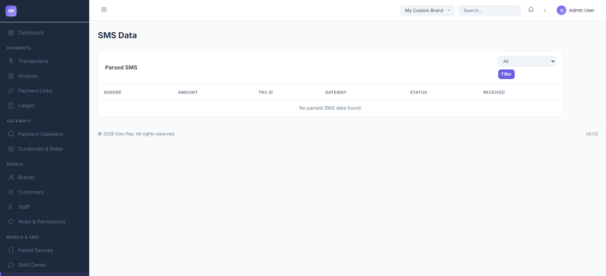

# SMS Data Logs

> **Purpose:** Review raw forwarded SMS messages, check parser extraction statuses, and manually resolve unmatched payments.

---

## Overview

The SMS Data Logs page displays all text messages forwarded from your paired Android devices. It acts as an audit trail for your automated manual gateway verification system, showing whether each SMS was matched to a transaction, is still pending review, or was rejected (unmatched) due to pattern discrepancies.

---

## Getting Here

To access the SMS Data logs:
1. Log in to the OwnPay admin dashboard.
2. Under the **MOBILE & SMS** section in the left sidebar, click **SMS Data**.

---

## Page Sections

The SMS Data panel contains:

### 1. Match Filters Dropdown
Located above the table, allowing you to filter logs by matching status:
* **All:** Shows all forwarded SMS records.
* **Matched:** Displays SMS messages that successfully matched a customer's transaction ID and automatically approved a payment.
* **Unmatched:** Displays forwarded SMS messages that did not map to any active checkout transaction.
* **Pending:** Displays forwarded SMS messages awaiting template mapping or manual checkups.

### 2. Parsed SMS Table
Displays individual logs:
* **SENDER:** The source phone number or sender ID (e.g. `NAGAD`).
* **AMOUNT:** Visual display of the cash amount parsed from the message.
* **TRX ID:** The extracted Transaction ID.
* **GATEWAY:** The manual gateway slug associated with the template.
* **STATUS:** Visual status badge (`matched` in green, `unmatched` in red, `pending` in yellow).
* **RECEIVED:** Exact timestamp when the forwarded SMS reached the server.

---

## Fields & Options Reference

### SMS Data Table Column Reference
| Table Header | Type | Description |
|---|---|---|
| **SENDER** | Text | The sender name or gateway phone number parsed from the message. |
| **AMOUNT** | Currency | The currency amount extracted from the text body. |
| **TRX ID** | Text Code | The unique Transaction ID parsed from the text body. |
| **GATEWAY** | Text Link | The manual gateway associated with the template match (e.g. `nagad-personal`). |
| **STATUS** | Badge | Current state: `matched`, `unmatched`, `pending`. |
| **RECEIVED** | Date | Timestamp of when the companion app sent the payload to the server. |

---

## Step-by-Step: How to Use This Page

### Resolving a Customer's Missing Payment
1. If a customer reports that their manual wallet payment (e.g., via Nagad) did not go through:
2. Ask the customer for their **Transaction ID** (TrxID) or the sender phone number.
3. Open the **SMS Data** logs.
4. Filter by **Unmatched** or **Pending** to locate the forwarded text message.
5. If you find the message with the matching TrxID:
   * Verify the amount matches the customer's checkout amount.
   * If it matches, navigate to the **Transactions** dashboard, locate the pending transaction, and click **Approve** manually.
   * Check the **SMS Center** parsing rules to see why the auto-matching regex failed.

---

## Configuration Guide

* **SMS Status States:**
  * `matched`: The transaction ID extracted from the SMS matched a pending transaction record in the database. The transaction was marked as `completed` and the ledger adjusted.
  * `unmatched`: The SMS was parsed, but the transaction ID did not match any active checkout transaction on the server.
  * `pending`: The SMS is queued for parsing or lacks a matching template pattern.

---

## Best Practices

- ✅ **Do:** Regularly monitor **Unmatched** logs to see if customers are inputting incorrect transaction IDs at checkout.
- ✅ **Do:** Verify the raw SMS body text in the log before executing manual approvals.
- ❌ **Don't:** Manually delete SMS data logs unless performing system maintenance, as they serve as physical transaction verification receipts.
- ❌ **Don't:** Worry if spam SMS messages appear as `unmatched`; the parser will ignore any messages that do not contain matching wallet templates.

---

## Must Do

> ⚠️ Always cast transaction IDs to strings. If writing a custom script to query these logs, do not treat UUIDs or TrxIDs as numbers to prevent query failure.

---

## Related Pages

- [SMS Center](./sms-templates.md) - Configure the parsing patterns that populate these logs.
- [Paired Devices](./devices.md) - Connect the companion phones that forward these messages.
- [Transactions](../payments/transactions.md) - Manually approve payments.
