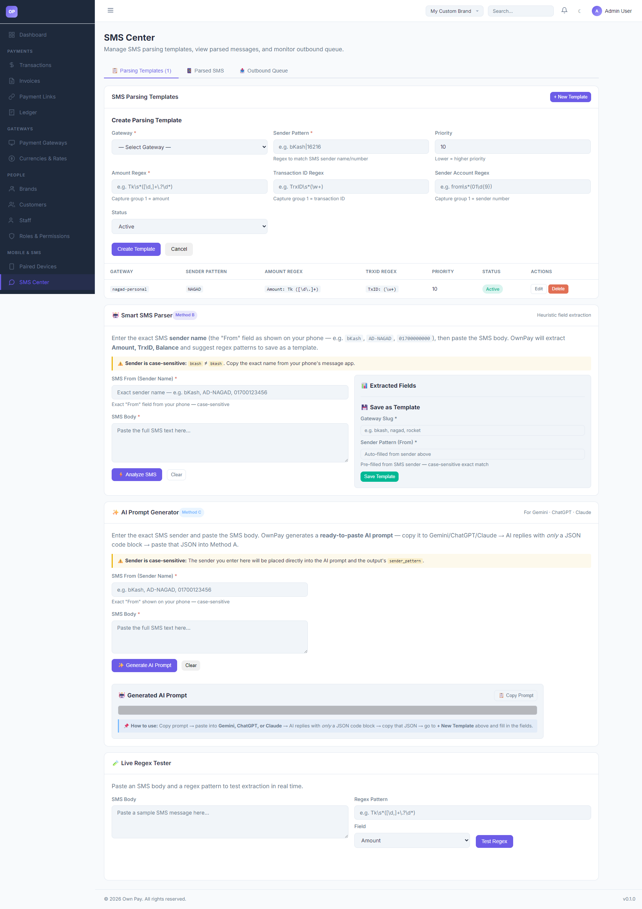

# SMS Center & Parsing Templates

> **Purpose:** Create and manage regex rules and heuristic patterns to parse incoming payment SMS messages from mobile wallets.

---

## Overview

The SMS Center is the central parsing control board for manual gateway automation. When a companion device forwards an SMS transaction notification, the server maps the message to the corresponding gateway by matching the **Sender Pattern** (From) and extracting key fields (Amount, Transaction ID, and Sender Number) using regular expressions (Regex) or heuristic analysis.

---

## Getting Here

To access the SMS Center:
1. Log in to the OwnPay admin dashboard.
2. Under the **MOBILE & SMS** section in the left sidebar, click **SMS Center**.

---

## Page Sections

The SMS Center consists of the following key utilities:

### 1. Parsing Templates List
Lists all active SMS pattern matchers:
* **GATEWAY:** The targeted gateway slug (e.g., `nagad-personal`).
* **SENDER PATTERN:** The regex matching the sender's identifier (e.g. `NAGAD` or `bKash`).
* **AMOUNT REGEX:** Capture pattern for the transfer amount.
* **TRXID REGEX:** Capture pattern for the unique Transaction ID.
* **PRIORITY:** Execution priority order (1-999).
* **STATUS:** Active or Inactive.
* **ACTIONS:** Edit or Delete templates.

### 2. Create Parsing Template
Form to register a new pattern rule:
* **Gateway Dropdown:** Link to one of your active manual gateways.
* **Sender Pattern:** The sender's ID.
* **Amount / Transaction ID / Sender Account Regex:** Capture groups where group `(1)` is extracted.

### 3. Smart SMS Parser (Method B - Heuristic)
A visual helper that allows you to paste a sample SMS and let the system suggest a regex template based on automated structural analysis.

### 4. AI Prompt Generator (Method C)
Generates a structured prompt to copy-paste into an AI chat assistant (Gemini, ChatGPT, or Claude). The AI translates the message structure into a JSON parsing block.

### 5. Live Regex Tester
A testing sandbox where you can paste a sample SMS, enter a regex string, select the target field, and click **Test Regex** to check extraction matches in real time.

---

## Fields & Options Reference

### Parsing Template Form Fields
| Field Name | Type | Required? | Example | Description |
|---|---|---|---|---|
| **Gateway** | Select | Yes | Nagad Personal | Target manual gateway to auto-verify. |
| **Sender Pattern** | Text Input | Yes | `NAGAD` or `bKash` | Matches the "From" header (case-sensitive). |
| **Priority** | Spin Button | No | 10 | Order of rule evaluation (lower numbers run first). |
| **Amount Regex** | Text Input | Yes | `Amount: Tk ([\d\.]+)` | Captures the payment amount in group 1. |
| **Transaction ID Regex** | Text Input | No | `TxID: (\w+)` | Captures the gateway Transaction ID in group 1. |
| **Sender Account Regex** | Text Input | No | `Customer: (01\d{9})` | Captures client phone in group 1. |
| **Status** | Select | Yes | Active | Options: `Active`, `Inactive`. |

---

## Step-by-Step: How to Use This Page

### Creating a Regex Template Manually
1. Navigate to the **SMS Center** and click **+ New Template**.
2. Select your manual **Gateway** (e.g., `Nagad Personal`).
3. Set the **Sender Pattern** to match the sender ID (e.g. `NAGAD`).
4. Type the **Amount Regex** to capture the cash value (e.g., `Amount: Tk ([\d\.]+)`).
5. Type the **Transaction ID Regex** to isolate the TrxID (e.g., `TxID: (\w+)`).
6. Click **Create Template** to save.

### Testing a Template using Live Regex Tester
1. Scroll to the **Live Regex Tester** section.
2. Paste a real SMS message in the **SMS Body** textbox.
3. Enter your regex pattern in the **Regex Pattern** input (e.g., `TxID: (\w+)`).
4. Select the target **Field** (e.g., `Transaction ID`).
5. Click **Test Regex**. The result box will show the captured value (e.g. `12A34B56C7`).

---

## Configuration Guide

* **Regex Capture Group Requirements:**
  * All regex inputs must include parentheses `()` to designate the **first capture group** `(1)`.
  * For example, in `Tk\s*([\d,]+\.?\d*)`, the parentheses capture the numerical value, skipping the currency prefix `Tk`. Bypassing capture groups will cause parsing failures.

---

## Best Practices

- ✅ **Do:** Test all regex patterns in the **Live Regex Tester** before saving templates.
- ✅ **Do:** Set strict sender patterns to avoid cross-matching SMS alerts from general notification sources.
- ❌ **Don't:** Forget that sender patterns are case-sensitive. `NAGAD` is not the same as `nagad`.
- ❌ **Don't:** Include global flags (like `/g`) inside the regex text boxes.

---

## Must Do

> ⚠️ When writing regex, ensure the expression is safe from ReDoS (Regular Expression Denial of Service). Avoid nested quantifiers (e.g., `(a+)+`).

---

## Related Pages

- [Paired Devices](./devices.md) — Connect mobile companion apps.
- [SMS Data](./sms-logs.md) — Monitor real-time parsed SMS logs.
- [Payment Gateways](../gateways/gateways.md) — Bind manual gateways to SMS parsing triggers.
