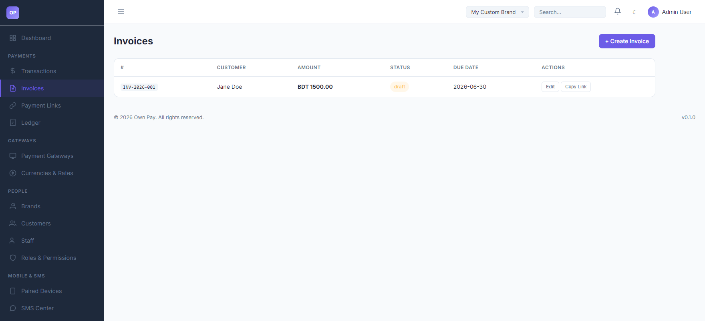
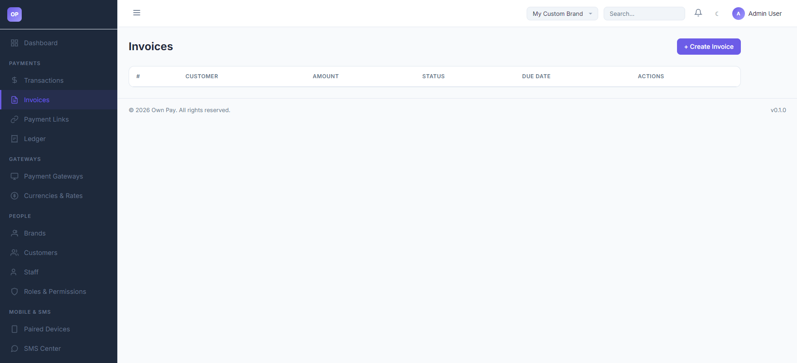
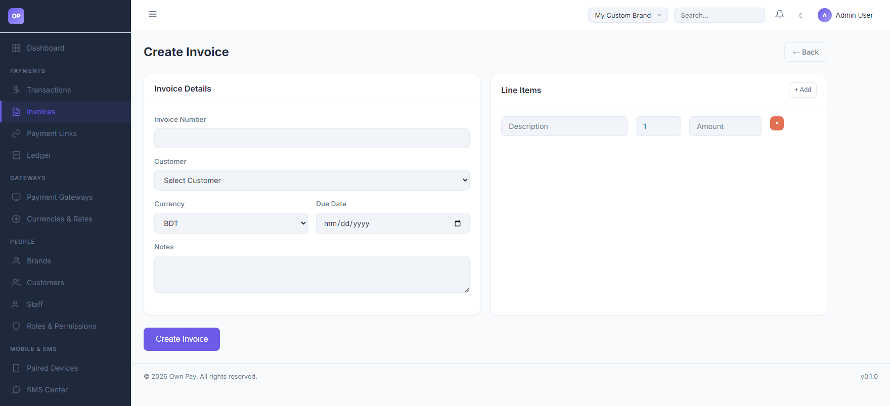
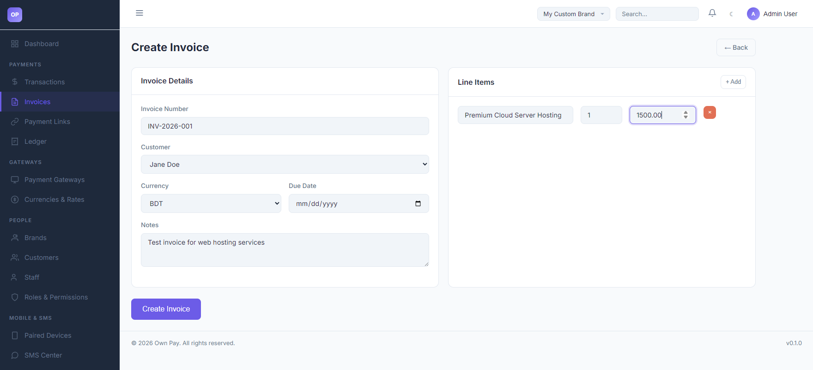

# Invoices

> **Purpose:** Detailed billing tool to create, customize, and issue itemized invoices to customers for custom goods or services.

---

## Overview

The Invoices page enables you to issue structured, multi-item billings to your customers. Customers receive a unique payment link where they can choose their preferred payment method (such as bKash, Nagad, or card options) to complete the invoice. The billing amounts, currency, and line items are tracked natively in your merchant ledger.

---

## Getting Here

To access the Invoices page:
1. Log in to the OwnPay admin dashboard.
2. Under the **PAYMENTS** section in the left sidebar, click **Invoices**.

---

## Page Sections

The invoices management dashboard comprises the list screen and the creation form:

### 1. Invoices List Table
Lists all issued invoices:
* **Invoice Number (#):** The unique invoice serial ID (e.g. `INV-2026-001`).
* **Customer:** The target billing customer.
* **Amount:** The total calculated invoice subtotal.
* **Status:** Current payment status (`draft`, `sent`, `paid`, `overdue`, `cancelled`).
* **Due Date:** Deadline for invoice settlement.
* **Actions:** Edit the invoice details or click **Copy Link** to share the checkout URL with the customer.

### 2. Create Invoice Form
Accessed by clicking the **+ Create Invoice** button:
* **Invoice Details:** Contains Invoice Number, Customer Selector, Currency, Due Date, and internal Customer Notes.
* **Line Items:** Dynamic multi-item editor where you specify Item Description, Quantity, and Unit Price.
* **Calculation Summary:** Displays computed subtotal and total values.

---

## Fields & Options Reference

### Invoice Form Fields
| Field / Option | Type | Required? | Default | Description |
|---|---|---|---|---|
| **Invoice Number** | Text Input | Yes | - | Unique billing serial number (e.g. `INV-0001`). |
| **Customer** | Select | Yes | - | Dropdown listing registered customers. You must register a customer before invoicing them. |
| **Currency** | Select | Yes | BDT | Currency in which the customer will be billed. |
| **Due Date** | Date Picker | Yes | - | The final date by which the payment is expected. |
| **Notes** | Text Area | No | - | Custom instructions, bank details, or checkout terms shown to the customer. |
| **+ Add** | Button | No | - | Inserts a new line item row in the invoice. |
| **Description** | Text Input | Yes | - | Summary of the specific product or service rendered. |
| **Quantity** | Spinbutton | Yes | 1 | Number of units billed. |
| **Amount** | Spinbutton | Yes | 0.00 | Unit price of the specific item. |

---

## Step-by-Step: How to Use This Page

### Creating and Issuing a New Invoice
1. Click the **+ Create Invoice** button on the top right.
2. Input a unique identifier in the **Invoice Number** field.
3. Select your customer from the **Customer** dropdown list.
4. Select the billing **Currency** (e.g. `BDT`).
5. Choose a **Due Date** using the calendar picker.
6. (Optional) Write a description in the **Notes** box (e.g., *"Thank you for your business!"*).
7. Under **Line Items**, write the description of the service (e.g. `Premium Cloud Server Hosting`).
8. Input the **Quantity** (e.g. `1`) and the **Unit Price** (e.g. `1500.00`).
9. (Optional) If you have multiple items, click the **+ Add** button to append more rows.
10. Click **Create Invoice**. The system will calculate the totals and redirect you back to the main list.

---

## Configuration Guide

* **Invoice Status Transitions:**
  * `draft`: The invoice has been saved but not sent to the customer.
  * `sent`: The invoice checkout link has been shared with the customer.
  * `paid`: The customer successfully processed payment via a gateway.
  * `overdue`: The due date has passed without successful payment.
  * `cancelled`: The invoice was marked as void by the merchant.
* **Auto-Recalculation:** Saving or updating an invoice automatically recalculates the subtotal and total from the line items list. Stale line item calculations are purged on save.

---

## Best Practices

- ✅ **Do:** Create a customer entry first before attempting to draft an invoice for them.
- ✅ **Do:** Click **Copy Link** to easily share the checkout URL via email, SMS, or Slack.
- ❌ **Don't:** Manually edit the database values of invoice totals; always update the line items so the system recalculates them correctly.
- ❌ **Don't:** Leave invoice numbers empty or duplicate them, as the system enforces unique invoice numbers per brand.

---

## Must Do

> ⚠️ When editing or saving an invoice, ensure that at least one (1) line item is present. Invoices with zero line items will result in a total of `0.00` BDT and cannot be processed.

---

## Optional / Can Skip

- **Notes** are entirely optional and can be left blank if not required.

---

## Common Mistakes & Troubleshooting

| Symptom | Likely Cause | Fix |
|---|---|---|
| Invoices total shows `0.00` BDT after save | Line items were not specified, or quantity/amount fields were left at zero. | Edit the invoice and specify valid quantities and unit prices for all line items. |
| Cannot see a customer in the dropdown | The customer has not been added to your brand yet. | Navigate to **People → Customers**, add the customer, and return to the invoice editor. |

---

## Related Pages

- [Customers](../people/customers.md) - Register new customers to bill.
- [Transactions](./transactions.md) - View payments resulting from paid invoices.
- [Checkout](./../public/checkout.md) - The customer invoice payment experience.
