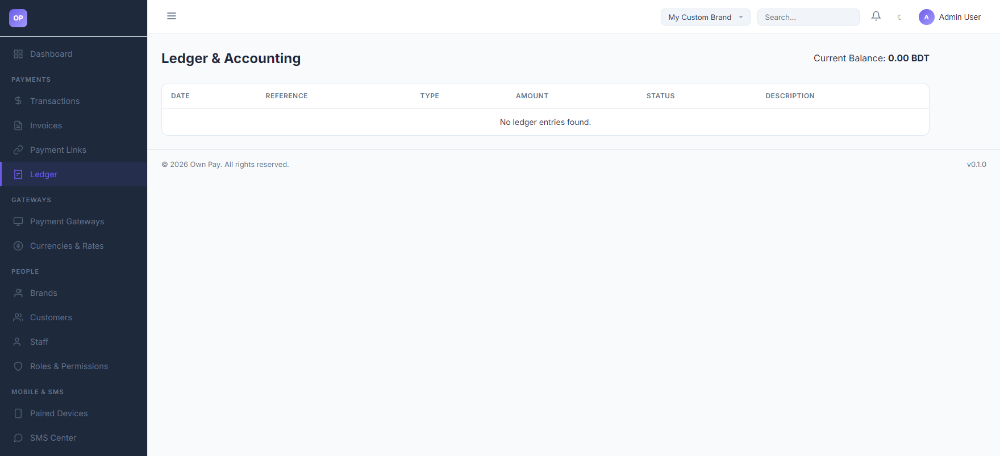

# Ledger & Accounting

> **Purpose:** Detailed log of double-entry ledger bookkeeping entries, asset/liability balances, and transaction audit trails.

---

## Overview

The Ledger page provides a transparent, GAAP-compliant double-entry accounting view of all financial movements for your brand. It displays the active brand's net balance and lists individual journal postings (debits and credits) with their corresponding references, types, amounts, and descriptions.

---

## Getting Here

To access the Ledger page:
1. Log in to the OwnPay admin dashboard.
2. Under the **PAYMENTS** section in the left sidebar, click **Ledger**.

---

## Page Sections

The Ledger interface is divided into the following key sections:

### 1. Account Summary Header
Located at the top of the page, this section displays:
* **Current Balance:** The net total of all posted ledger entries in the merchant's default currency (e.g., BDT or USD). It dynamically reflects increases from sales credits and decreases from payout/debit adjustments.

### 2. Ledger Entries Table
Lists all matched ledger entries in chronological order:
* **DATE:** The exact timestamp when the double-entry movement was recorded.
* **REFERENCE:** The unique identifier (such as Transaction ID, Invoice ID, or Checkout Token) that links the ledger entry to its originating transaction or invoice.
* **TYPE:** The direction of the financial movement:
  * **Debit (DR):** Increases assets or expenses; decreases liabilities, equity, or revenue.
  * **Credit (CR):** Increases liabilities, equity, or revenue; decreases assets or expenses.
* **AMOUNT:** The cash value of the entry in the brand's default currency.
* **STATUS:** The posting status (typically `posted` once successfully written and balanced).
* **DESCRIPTION:** Text describing the nature of the entry (e.g., "Payment received for INV-2026-001" or "System Fee adjustment").

---

## Fields & Options Reference

### Entries Table Column Reference
| Column | Type | Description |
|---|---|---|
| **DATE** | Timestamp | The UTC timestamp when the ledger record was written. |
| **REFERENCE** | Text Link / ID | The originating document identifier (e.g. `TXN-XXXX`). |
| **TYPE** | Code | `Debit` (DR) or `Credit` (CR) indicating the posting direction. |
| **AMOUNT** | Currency | The amount associated with the specific entry line. |
| **STATUS** | Label | Current posting state of the entry (e.g., `posted`, `pending`). |
| **DESCRIPTION** | Text | Human-readable explanation of why this entry was created. |

---

## Step-by-Step: How to Use This Page

### Reviewing Brand Account Balances
1. Navigate to the **Ledger** page.
2. Observe the **Current Balance** block. This shows your brand's current net position.
3. Review the ledger table for recent credit entries (`TYPE: Credit`) representing sales, or debit entries (`TYPE: Debit`) representing platform fees, customer refunds, or withdrawals.

### Auditing a Transaction
1. Locate the entry corresponding to the transaction you wish to audit.
2. Copy the **REFERENCE** identifier.
3. Go to the **Transactions** page and search for the copied reference ID to inspect the original customer metadata, IP address, and gateway transaction details.

---

## Configuration Guide

* **The Double-Entry Model:**
  * OwnPay automatically registers balanced entries for every transaction.
  * When a checkout completes:
    * A credit (CR) entry is posted to the brand's payable account (`MERCHANT_PAYABLE`) representing revenue.
    * A debit (DR) entry is posted to the asset account representing the processing gateway balance.
  * Webhook/payout logs should be periodically cross-referenced with these ledger balances to identify discrepancy points.

---

## Best Practices

- ✅ **Do:** Verify the **Current Balance** against your physical gateway summaries (bKash/Nagad/Stripe portals) weekly.
- ✅ **Do:** Use the **REFERENCE** field to trace transaction roots whenever customer disputes or chargebacks arise.
- ❌ **Don't:** Expect the ledger balance to update instantly for offline or unapproved manual gateways.
- ❌ **Don't:** Manually modify the database tables `op_ledger_entries` or `op_ledger_accounts` as it will break the double-entry balance validation constraints.

---

## Must Do

> ⚠️ Every ledger transaction must balance. The sum of credits must equal the sum of debits. Do not initiate manually customized payments that bypass the transactional API, as this will lead to ledger imbalance warnings and transaction rollbacks.

---

## Optional / Can Skip

- Checking individual ledger lines for small transaction amounts can be skipped if your weekly reports match the aggregate balance verification reports.

---

## Common Mistakes & Troubleshooting

| Symptom | Likely Cause | Fix |
|---|---|---|
| Current balance does not match my gateway account balance | Fees or pending payouts are not yet posted to the ledger, or manual gateway approvals are pending. | Check the **Balance Verification** page under Reports & Finance to verify and reconcile balances. |
| No ledger entries are appearing | You are scoped to a newly created brand or a brand with zero transaction history. | Ensure you have processed at least one successful checkout or payment link transaction under the active brand. |

---

## Related Pages

- [Transactions](./transactions.md) - View customer details and payment gateway statuses.
- [Invoices](./invoices.md) - Bill customers and track payment status.
- [Balance Verification](../reports-finance/balance-verification.md) - Audit and verify physical ledger balances.
