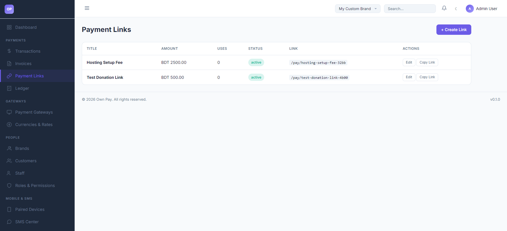
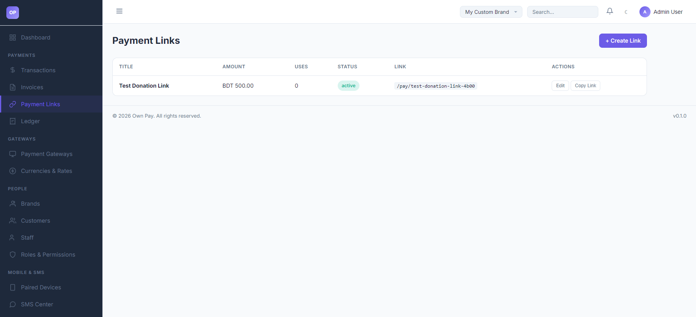
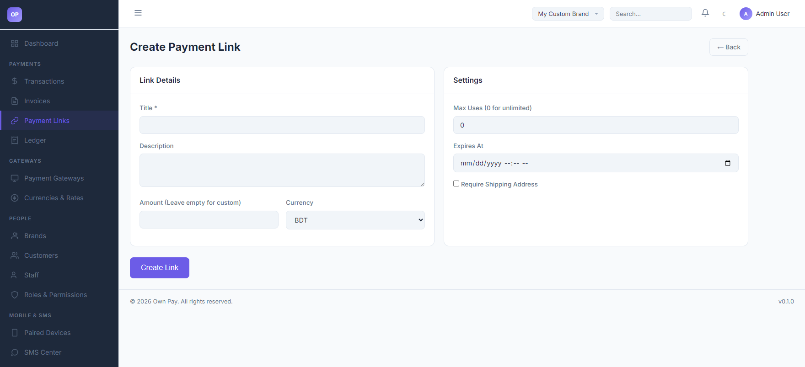
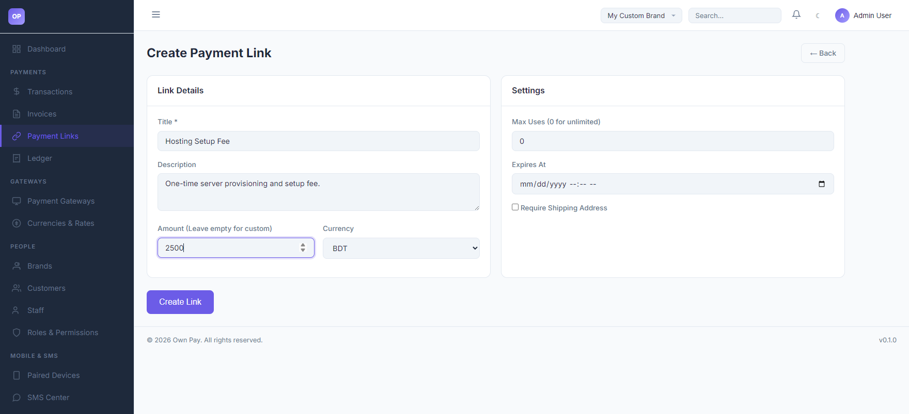

# Payment Links

> **Purpose:** Generate shareable payment URLs with optional custom input fields to collect one-off or recurring payments directly from customers.

---

## Overview

Payment Links are reusable checkout URLs designed to collect payments without generating a formal invoice. You can create a link for a fixed product price or leave the amount open so customers can input their own values (e.g. for donations or dynamic service fees). They are ideal for social media sharing, email buttons, or quick SMS-based collections.

---

## Getting Here

To access the Payment Links page:
1. Log in to the OwnPay admin dashboard.
2. Under the **PAYMENTS** section in the left sidebar, click **Payment Links**.

---

## Page Sections

The payment links module contains the list dashboard and the creation form:

### 1. Payment Links Dashboard
Displays all active and expired links:
* **Title:** Description shown to the customer on checkout (e.g. `Hosting Setup Fee`).
* **Amount:** BDT price or listed as `Custom` if customer-defined.
* **Uses:** Counter showing how many times the link has been paid.
* **Status:** Current availability (`active`, `inactive`, `expired`).
* **Link:** The relative public path (e.g. `/pay/hosting-setup-fee-32bb`).
* **Actions:** Edit details or copy the complete public checkout link.

### 2. Create Link Form
Accessed by clicking the **+ Create Link** button:
* **Link Details:** Basic configurations including Title, customer-facing Description, fixed/custom Amount, and Currency.
* **Settings:** Advanced conditions including Max Uses, Expiry Date, and a toggle to enforce shipping address collection.

---

## Fields & Options Reference

| Field / Option | Type | Required? | Default | Description |
|---|---|---|---|---|
| **Title** | Text Input | Yes | - | The name of the product or service. Visible to customers. |
| **Description** | Text Area | No | - | Explanatory note or instructions shown on the checkout screen. |
| **Amount** | Spinbutton | No | - | Leave blank to allow customers to input any amount. Enter a value to lock the checkout price. |
| **Currency** | Select | Yes | BDT | Currency to bill the customer. |
| **Max Uses** | Spinbutton | No | 0 | Limit how many times the link can be used. Set to `0` for unlimited uses. |
| **Expires At** | Date & Time | No | - | Set a date/time after which the link automatically deactivates. |
| **Require Shipping Address** | Checkbox | No | Unchecked | Enforces shipping address collection fields on the checkout screen. |

---

## Step-by-Step: How to Use This Page

### Creating a Reusable Payment Link
1. Click the **+ Create Link** button.
2. Enter a descriptive title in the **Title** field (e.g., `Hosting Setup Fee`).
3. (Optional) Provide details in the **Description** box.
4. Input a fixed price in the **Amount** field (e.g., `2500`). Leave it blank if you want the customer to type the amount.
5. Select the **Currency** (e.g. `BDT`).
6. Set **Max Uses** to `0` for unlimited checkouts.
7. (Optional) Set an **Expires At** deadline if this is a limited-time offer.
8. Click **Create Link**.
9. Locate the link on your dashboard and click **Copy Link**. You can now paste and share this link anywhere.

---

## Configuration Guide

* **Custom Fields & Quantities:**
  * When a customer visits a payment link with a fixed amount, they see the locked price.
  * If the link has a custom amount, the customer is prompted with an input field to enter their desired payment.
* **Tracking Use Count:**
  * Every successful payment completed via a payment link increments the `use_count` in the database. If `use_count` reaches `max_uses`, the link's status changes to `expired` and returns a 404/expired screen to subsequent visitors.

---

## Best Practices

- ✅ **Do:** Set a **Max Uses** value (e.g. `1`) if generating a single-use payment link for a specific customer.
- ✅ **Do:** Enforce **Require Shipping Address** if you are selling physical goods that need to be delivered.
- ❌ **Don't:** Change the slug of a payment link after sharing it, as this will break the existing URLs shared with customers.
- ❌ **Don't:** Use payment links for itemized corporate invoicing where details like due dates and item quantities need to be structured.

---

## Must Do

> ⚠️ Ensure that your manual gateways or API gateways are active before sharing a payment link, or customers will see an error when trying to choose a payment method.

---

## Optional / Can Skip

- **Max Uses** and **Expires At** settings are optional and can be left at defaults to keep links open indefinitely.

---

## Common Mistakes & Troubleshooting

| Symptom | Likely Cause | Fix |
|---|---|---|
| Customer sees a `Link Expired` error page | The link reached its **Max Uses** limit or the **Expires At** date has passed. | Edit the link in the admin panel and increase the max uses or extend/remove the expiry date. |
| Customer cannot select a payment method on the link | No payment gateways are active for the selected currency. | Navigate to **Payment Gateways** and activate at least one gateway (e.g. manual bkash/Nagad or card merchant configs). |

---

## Related Pages

- [Gateways](../gateways/gateways.md) - Configure payment processors.
- [Transactions](./transactions.md) - Inspect payments completed via links.
- [Payment Link Checkout](./../public/checkout.md) - Customer payment experience.
