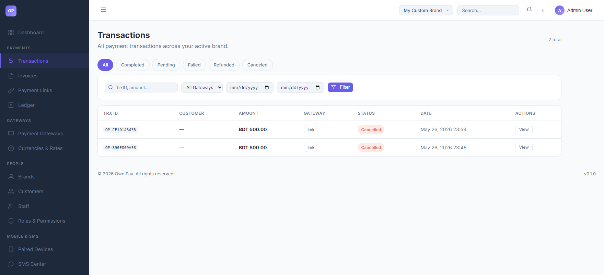
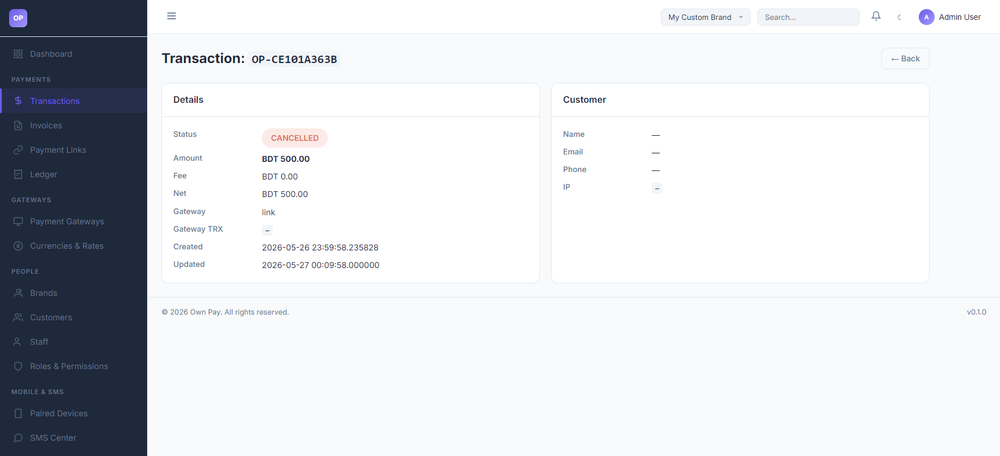

# Transactions

> **Purpose:** Detailed view of all incoming payments, payment attempts, and refunds processed through your gateways.

---

## Overview

The Transactions page allows you to search, monitor, and filter every financial movement on the OwnPay gateway. You can view payment details, trace customer information, check the routing gateway, and review the transaction lifecycle state (whether it is completed, pending, refunded, failed, or canceled).

---

## Getting Here

To access the Transactions page:
1. Log in to the OwnPay admin dashboard.
2. Under the **PAYMENTS** section in the left sidebar, click **Transactions**.

---

## Page Sections

The transactions interface includes the list view and the detailed view:

### 1. Filter Toolbar
Located at the top of the content area, this bar allows you to filter transactions:
* **Status Tab Filters:** Quick tabs to view `All`, `Completed`, `Pending`, `Failed`, `Refunded`, or `Canceled` transactions.
* **Search Input:** Match transactions by Transaction ID (TrxID) or payment amount.
* **Gateway Filter:** Dropdown to filter by specific payment gateways (e.g., Stripe, bKash, Nagad, or manual gateway links).
* **Date Range Pickers:** Filter by **From Date** and **To Date**.
* **Filter Button:** Applies the search and date range filters.

### 2. Transactions Table
Lists all matched transactions:
* **TRX ID:** Unique transaction code.
* **Customer:** Email or phone number of the customer.
* **Amount:** Transaction value and currency.
* **Gateway:** The processor used.
* **Status:** Visual badge indicating status (Completed in green, Pending in yellow, Cancelled/Failed in red).
* **Date:** The exact creation timestamp.
* **Actions:** Click the **View** button to open the detailed panel.

### 3. Transaction Details Page
Accessed by clicking **View** on a transaction. It provides in-depth data:
* **Details Block:** Status, Amount, Gateway Fee (if any), Net Amount, Gateway Transaction ID, and creation/update timestamps.
* **Customer Block:** Customer name, email, phone number, and IP address.
* **Ledger Entries (Optional):** Correlated double-entry journal movements showing debits (DR) and credits (CR).

---

## Fields & Options Reference

### Filters & Controls
| Field / Option | Type | Required? | Default | Description |
|---|---|---|---|---|
| **Search Box** | Text Input | No | - | Enter a search term (TrxID or partial amount) to quickly search records. |
| **Gateway Dropdown** | Select | No | All Gateways | Filter by the payment processor that processed the transaction. |
| **From / To Date** | Date Picker | No | - | Filter transactions within a specific date range. |
| **Filter Button** | Button | Yes | - | Executes the filter query on the table. |

### Detail Page Reference
| Field / Label | Type | Description |
|---|---|---|
| **Status** | Badge | Current state. Options: `COMPLETED`, `PENDING`, `FAILED`, `REFUNDED`, `CANCELLED`. |
| **Amount** | Currency | The total amount paid by the customer. |
| **Fee** | Currency | Processing fee charged by the gateway. |
| **Net** | Currency | Amount credited to your ledger (Amount minus Fee). |
| **Gateway TRX** | Text | The transaction ID returned by the payment processor. |

---

## Step-by-Step: How to Use This Page

### Filtering Transactions
1. Navigate to the **Transactions** page.
2. Select a status tab (e.g., click **Completed** to view only successful payments).
3. Type the customer's email or TrxID in the search box.
4. Click **Filter**.

### Reviewing Transaction Details
1. Find your target transaction in the table.
2. Click the **View** button under the **Actions** column.
3. Review the customer IP, gateway fee structures, and timestamps.
4. If you need to trace double-entry ledger details, click the **Ledger** link or cross-reference the transaction ID on the Ledger page.

---

## Configuration Guide

* **Transaction Status Life Cycle:**
  * `pending`: The customer opened the checkout screen but has not completed payment.
  * `completed`: The payment was successfully processed, and the funds have been registered.
  * `failed`: The payment processor rejected the transaction.
  * `refunded`: The funds were returned to the customer, and a reversing ledger entry was posted.
  * `cancelled`: The checkout expired or was explicitly cancelled by the customer.

---

## Best Practices

- ✅ **Do:** Verify the **Gateway TRX ID** against your physical bank/wallet statements (like bKash or Nagad merchant statements) before delivering high-value goods.
- ✅ **Do:** Monitor **Failed** transactions to determine if customers are facing issues with specific payment gateways.
- ❌ **Don't:** Manually verify or force-complete a transaction unless you have absolute proof of receipt.
- ❌ **Don't:** Share screenshots of transaction detail screens containing customer IP addresses or personal emails.

---

## Must Do

> ⚠️ Before refunding a transaction, verify that the reversing debit ledger entry will not push your merchant account balance below zero.

---

## Optional / Can Skip

- **Date Range Filters** can be left blank to view all transactions regardless of when they occurred.

---

## Common Mistakes & Troubleshooting

| Symptom | Likely Cause | Fix |
|---|---|---|
| No transactions show up | You are in "Global View" but have no global permissions, or you switched to a brand with no transactions. | Double-check the **Brand Context** in the top header and switch to the correct brand. |
| The status remains `pending` after customer claims to have paid | The webhook callback from the gateway (e.g. bKash IPN) failed, or the SMS parsing device is offline. | Check the Developer Webhook logs or the Paired Devices screen to see if SMS matches are pending admin review. |

---

## Related Pages

- [Dashboard](../dashboard/dashboard.md) - Real-time overview of transaction volumes.
- [Ledger](./ledger.md) - Financial movements audit trails.
- [Invoices](./invoices.md) - Requesting payments through structured invoices.
