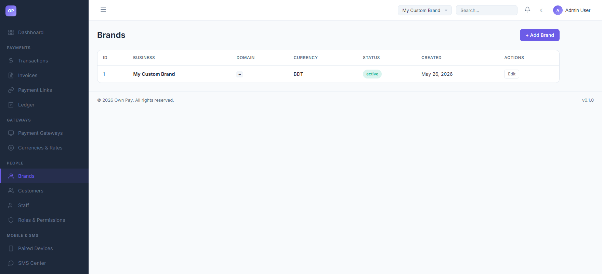
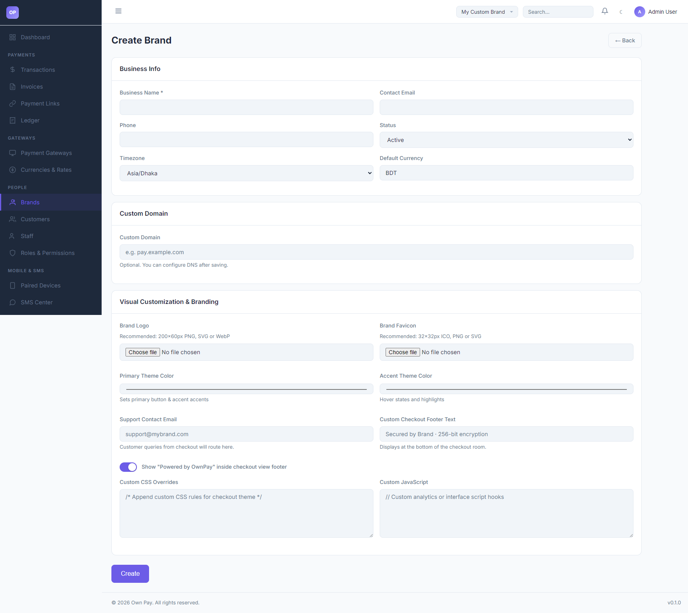

# Brands

> **Purpose:** Setup and configure white-label brand/store fronts, custom domains, visual templates, and localized currencies.

---

## Overview

OwnPay operates as a single-owner, multi-brand payment gateway system. The primary administrator can create and customize distinct brand identities (stores) that operate under their own domain hostnames, email support routes, visual color palettes, and CSS styles. This shields the parent gateway server brand from checkout customers.

---

## Getting Here

To access the Brands settings:
1. Log in to the OwnPay admin dashboard as the super-administrator.
2. Under the **PEOPLE** section in the left sidebar, click **Brands**.

---

## Page Sections

The Brands management view contains:

### 1. Brands List Table
Lists all configured brands on the server:
* **ID:** The unique database identifier of the brand (`merchant_id`).
* **BUSINESS:** The visual trade name.
* **DOMAIN:** The verified custom domain linked to the brand.
* **CURRENCY:** Default base ledger and checkout currency (e.g. BDT, USD).
* **STATUS:** Active, Suspended, or Pending.
* **CREATED:** Date the brand was registered.
* **ACTIONS:** Click **Edit** to modify brand options, routing settings, and stylesheet overrides.

### 2. Create Brand Wizard
Accessed by clicking the **+ Add Brand** button:
* **Business Info:** Name, contact info, timezone, and default base currency.
* **Custom Domain:** Link the white-label domain name (e.g. `pay.mybusiness.com`).
* **Visual Customization & Branding:** Upload brand logo and favicon, set primary and accent colors, support mail routes, custom checkout footer text, and inject custom CSS/JavaScript codes.

---

## Fields & Options Reference

### Brand Settings Field Reference
| Field / Input | Type | Required? | Default | Description |
|---|---|---|---|---|
| **Business Name** | Text Input | Yes | — | The public facing name of the store. |
| **Contact Email** | Text Input | No | — | General business contact email address. |
| **Phone** | Text Input | No | — | General business contact phone number. |
| **Status** | Select | Yes | Active | Options: `Active` (online), `Suspended` (blocks checkout), `Pending`. |
| **Timezone** | Select | Yes | Asia/Dhaka | Set timezone for reports and date offsets. |
| **Default Currency** | Text Input | Yes | BDT | Currency symbol for transactions and ledgers. |
| **Custom Domain** | Text Input | No | — | Fully qualified domain name mapping to this brand context. |
| **Brand Logo** | File Upload | No | — | Upload file for the checkout brand logo. Recommended: 200x60px PNG. |
| **Brand Favicon** | File Upload | No | — | Browser tab icon. Recommended: 32x32px ICO/PNG. |
| **Primary Theme Color** | Color Picker | No | `#0d9488` | Theme color for major buttons and accents. |
| **Accent Theme Color** | Color Picker | No | `#0f766e` | Theme color for button hover states. |
| **Support Contact Email** | Text Input | No | — | Customer queries from checkout will route here. |
| **Custom CSS Overrides** | Text Area | No | — | Stylesheet rule overrides loaded on the checkout page. |
| **Custom JavaScript** | Text Area | No | — | Script overrides loaded on checkout. |

---

## Step-by-Step: How to Use This Page

### Creating a New Brand
1. Click the **+ Add Brand** button.
2. Under **Business Info**, type the **Business Name** (e.g. `Alpha Store`).
3. Set the base **Default Currency** (e.g. `USD`).
4. Under **Custom Domain**, input the domain (e.g. `pay.alphastore.com`).
5. Choose custom branding colors matching your store's palette.
6. Click **Create** to save.

---

## Configuration Guide

* **Domain Middleware Resolution:**
  * When a custom domain is mapped:
    1. Set the domain name in the **Custom Domain** input.
    2. Configure a CNAME record in your DNS provider pointing your domain to the OwnPay server IP address.
    3. The platform's `DomainMiddleware` will capture the incoming HTTP host, verify the DNS connection, and automatically load this brand context (custom theme, colors, logo) while blocking access to `/admin` routes.

---

## Best Practices

- ✅ **Do:** Double-check that your **Support Contact Email** is active, as customers will receive this address for transaction queries.
- ✅ **Do:** Append clear and custom **CSS Overrides** to make your checkout page align with your main website's look.
- ❌ **Don't:** Change the default currency after transactions have been processed, as it will cause inconsistencies in reporting.
- ❌ **Don't:** Type `http://` or `https://` in the custom domain field; only enter the hostname (e.g. `pay.example.com`).

---

## Must Do

> ⚠️ Ensure staff users are explicitly assigned to their brand. If they try to access a brand they are not assigned to, they will be blocked by system role access controls.

---

## Related Pages

- [Domains](../system/domains.md) — Manage DNS checks and domains.
- [Staff](./staff.md) — Create and assign staff to brands.
- [Themes](../appearance/themes.md) — Switch brand visual templates.
