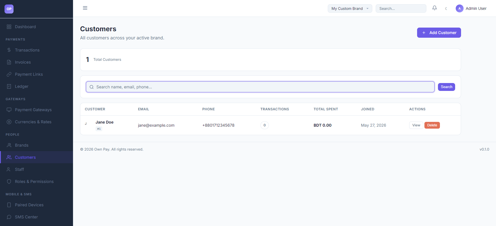
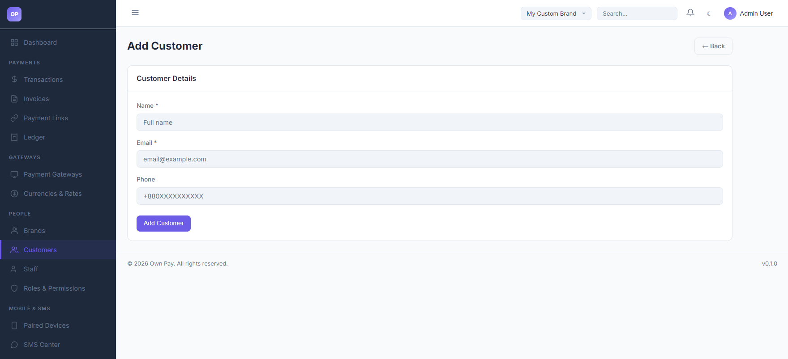

# Customers

> **Purpose:** Browse and manage customer profiles, monitor transaction histories, and audit total customer spending.

---

## Overview

The Customers page is a repository of all clients who have processed payments, had invoices issued, or paid through payment links for your active brand. You can search customers, view their contact information, check their accumulated transaction history, and see their total spent metrics.

---

## Getting Here

To access the Customers manager:
1. Log in to the OwnPay admin dashboard.
2. Under the **PEOPLE** section in the left sidebar, click **Customers**.

---

## Page Sections

The Customers interface includes:

### 1. Customers List View
The master list of customers registered under your brand:
* **KPI Metrics Card:** Displays the current **Total Customers** count.
* **Search Toolbar:** Search customers by name, email, or phone number.
* **Customers Table:** Lists clients showing Name/ID, Email, Phone, transaction volume, Total Spent in base currency, and creation date.
* **Actions:** View full customer profile details or Delete records.

### 2. Customer Creation Wizard
Accessed by clicking the **Add Customer** button:
* **Name:** Full visual name of the client.
* **Email:** Email address used to deliver payment notifications and receipts.
* **Phone:** Optional mobile contact number.

---

## Fields & Options Reference

### Customer Creation Fields
| Field Name | Type | Required? | Placeholder | Description |
|---|---|---|---|---|
| **Name** | Text Input | Yes | Full name | The client's full name. |
| **Email** | Text Input | Yes | email@example.com | Main billing and receipt contact email. |
| **Phone** | Text Input | No | +880XXXXXXXXXX | Mobile or landline contact number. |

---

## Step-by-Step: How to Use This Page

### Creating a Customer Profile Manually
1. Click the **Add Customer** button.
2. Enter the customer's **Name** (e.g. `John Doe`).
3. Type their **Email** address (e.g. `john@example.com`).
4. Type their **Phone** number (e.g. `+8801700000000`).
5. Click **Add Customer** to save the profile.

### Reviewing Customer Spending
1. Navigate to the **Customers** list page.
2. Locate the customer in the table (or use the search box).
3. Observe the **TRANSACTIONS** count and **TOTAL SPENT** fields to see their lifetime value.
4. Click **View** under actions to inspect all historical invoices and payments linked to this customer.

---

## Configuration Guide

* **Automatic Customer Registration:**
  * Customers do not always need to be created manually.
  * When checkout links (`/checkout/{token}`) or payment links (`/pay/{slug}`) are completed by new clients, the system automatically registers their email and details in the `op_customers` table under your brand's `merchant_id` context.

---

## Best Practices

- ✅ **Do:** Search for existing customer emails before manually adding a new customer profile to prevent duplicates.
- ✅ **Do:** Verify that customer emails are formatted correctly so invoice notifications are delivered successfully.
- ❌ **Don't:** Delete customer profiles with active transactions, as it can orphan transaction history records.

---

## Must Do

> ⚠️ Customer data is encrypted in the database. Ensure that you have permissions to view customer profiles, as staff role restrictions may mask or block access to raw email and phone records.

---

## Related Pages

- [Transactions](../payments/transactions.md) — Inspect customer payments.
- [Invoices](../payments/invoices.md) — Create and send invoices to customer profiles.
- [Staff](./staff.md) — Manage team members handling customer queries.
