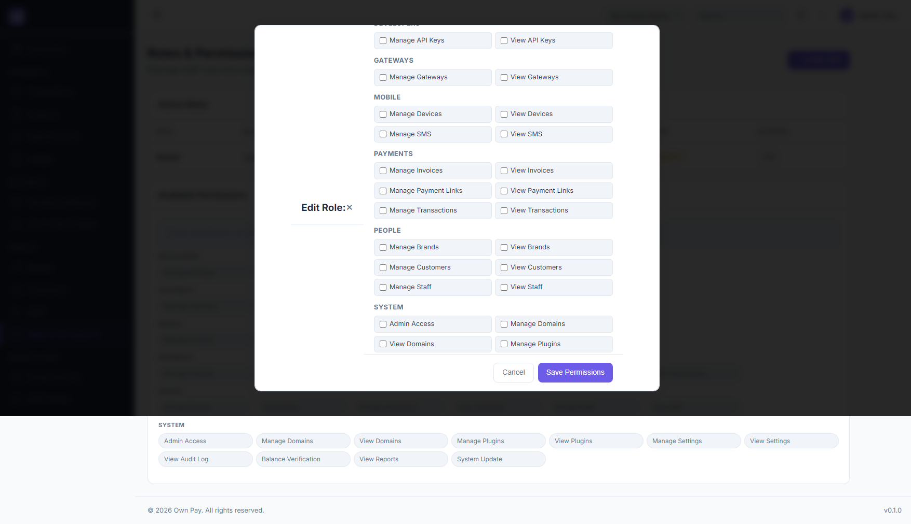

# Roles & Permissions

> **Purpose:** Configure user role categories (RBAC) and map granular capability flags across system modules.

---

## Overview

OwnPay implements a Role-Based Access Control (RBAC) authorization layer. Super-administrators can define distinct roles (e.g. Owner, Customer Support, Accountant) and select precisely which actions users with that role can take. Permissions are grouped logically by modules like Gateways, Payments, People, and Developers.

---

## Getting Here

To access the Roles & Permissions manager:
1. Log in to the OwnPay admin dashboard as the super-administrator.
2. Under the **PEOPLE** section in the left sidebar, click **Roles & Permissions**.

---

## Page Sections

The Roles & Permissions interface is divided into the following key panels:

### 1. Active Roles List
Lists all created roles defined on the platform:
* **ROLE:** Human-readable title of the role (e.g. `Owner`).
* **SLUG:** System identifier used in database permission checks.
* **DESCRIPTION:** Text describing the role's scope.
* **PERMISSIONS:** Total number of permission checkboxes active for this role.
* **TYPE:** Indicates whether the role is a default `System` role or a user-created brand role.
* **ACTIONS:** Click **Edit** to modify name, description, or assigned capability flags.

### 2. Available Permissions Grid
A comprehensive index of all permission nodes defined in the codebase, grouped by module:
* **DEVELOPERS:** `Manage API Keys`, `View API Keys`.
* **GATEWAYS:** `Manage Gateways`, `View Gateways`.
* **MOBILE:** `Manage Devices`, `View Devices`, `Manage SMS`, `View SMS`.
* **PAYMENTS:** `Manage Invoices`, `View Invoices`, `Manage Payment Links`, `View Payment Links`, `Manage Transactions`, `View Transactions`.
* **PEOPLE:** `Manage Brands`, `View Brands`, `Manage Customers`, `View Customers`, `Manage Staff`, `View Staff`.
* **SYSTEM:** `Admin Access`, `Manage Domains`, `View Domains`, `Manage Plugins`, `View Plugins`, `Manage Settings`, `View Settings`, `View Audit Log`, `Balance Verification`, `View Reports`, `System Update`.

### 3. Create Role & Edit Role Modals
Slide-out or inline forms to create new roles or edit existing ones, including text fields for **Role Name** and **Description**, and a check-box matrix to assign individual permissions.

---

## Fields & Options Reference

### Role Form Fields
| Field Name | Type | Required? | Placeholder | Description |
|---|---|---|---|---|
| **Role Name** | Text Input | Yes | e.g. Finance Manager | The display title of the role. |
| **Description** | Text Input | No | Brief description | Explain what staff in this role do. |
| **Assign Permissions** | Checkboxes | No | - | Check individual nodes to map them to the role. |

---

## Step-by-Step: How to Use This Page

### Creating a New Custom Role
1. Navigate to the **Roles & Permissions** page.
2. Click the **+ Create Role** button.
3. In the form, type a **Role Name** (e.g. `Finance Auditor`) and a brief **Description**.
4. In the **Edit Role** section below, select the specific permissions required (e.g., check `View Transactions`, `View Invoices`, and `View Reports`).
5. Click the **Create Role** button to save the new role category.

### Modifying an Existing Role
1. Find the target role in the **Active Roles** table.
2. Click the **Edit** button under **Actions**.
3. Modify the name or description, and update checked permission options.
4. Click **Save Permissions** to apply changes. All staff members assigned to this role will have their access permissions updated instantly.

---

## Configuration Guide

* **Permissions Resolution Hook:**
  * When any request is sent to the `/admin/*` panel, the system routes the request through `OwnPay\Middleware\PermissionMiddleware`.
  * The middleware matches the route against the defined permission mapping. For example, opening the `/admin/settings` route requires the `settings.view` permission.
  * If the user's role does not contain this permission flag, the request is aborted and a **403 Forbidden** page is displayed.

---

## Best Practices

- ✅ **Do:** Create specific, restricted roles for external users or support staff (e.g. `Support Staff` who can only view transactions).
- ✅ **Do:** Write clear descriptions for custom roles so other administrators understand their purpose.
- ❌ **Don't:** Modify default `System` roles like `Owner` unless absolutely necessary.
- ❌ **Don't:** Give general staff roles access to `Manage API Keys` or `Manage Domains` as these contain sensitive cryptographic credentials.

---

## Must Do

> ⚠️ Only super-administrators can access and edit the Roles & Permissions panel. Never assign the `staff.manage` permission to non-owners, as they could use it to elevate their own permissions or lock out other administrators.

---

## Related Pages

- [Staff](./staff.md) - Map staff members to roles.
- [Audit Log](../reports-finance/audit-log.md) - Audit actions performed by different roles.
