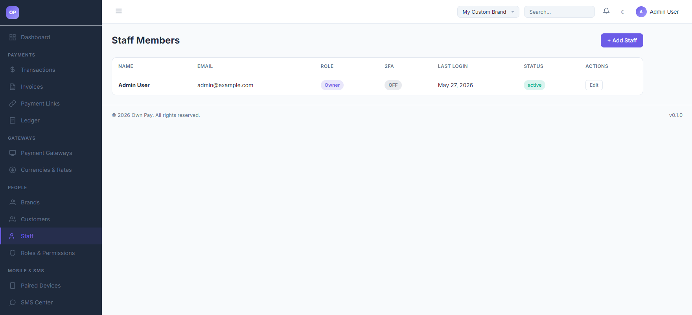
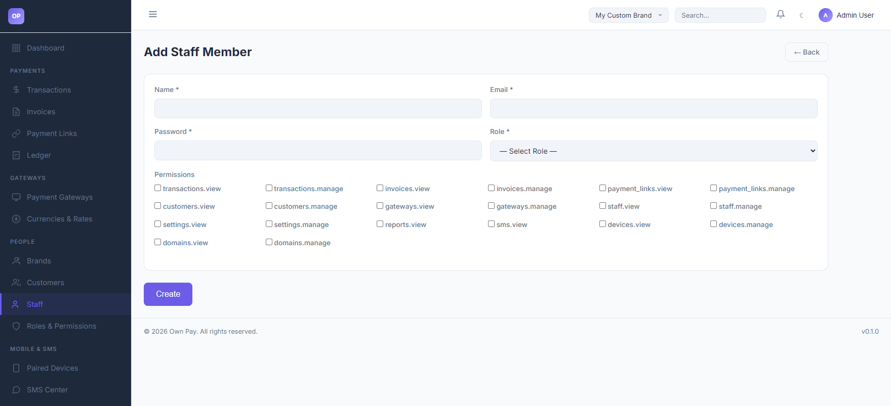

# Staff

> **Purpose:** Add team members, assign administrative roles, configure fine-grained permission scopes, and monitor activity logs.

---

## Overview

The Staff page allows the super-administrator to invite team members and assign them to specific roles and brand scopes. Instead of sharing credentials, each staff member logs in using their own email, password, and optional two-factor authentication (2FA). You can restrict their capabilities to specific sections (e.g. only view transactions, or only manage invoices).

---

## Getting Here

To access the Staff manager:
1. Log in to the OwnPay admin dashboard.
2. Under the **PEOPLE** section in the left sidebar, click **Staff**.

---

## Page Sections

The Staff interface includes:

### 1. Staff Members Table
Lists all administrative users configured under the active brand:
* **NAME:** Display name of the staff member.
* **EMAIL:** Email address used for authentication.
* **ROLE:** Assigned role type (e.g., Owner, Manager, or Support).
* **2FA:** Status of Two-Factor Authentication (displays `ON` or `OFF`).
* **LAST LOGIN:** Timestamp of the user's last login.
* **STATUS:** Account status (`active` or `suspended`).
* **ACTIONS:** Click **Edit** to update details, reset passwords, or suspend access.

### 2. Add Staff Member Panel
Accessed by clicking the **+ Add Staff** button:
* **Name / Email / Password:** Authentication credentials.
* **Role Dropdown:** Select the role definition to assign.
* **Permissions Checkbox Grid:** Select specific permission nodes to override or assign to this user.

---

## Fields & Options Reference

### Staff Form Fields
| Field Name | Type | Required? | Description |
|---|---|---|---|
| **Name** | Text Input | Yes | Full name of the staff member. |
| **Email** | Text Input | Yes | Login email address. |
| **Password** | Text Input | Yes | Initial login password. Needs to be at least 8 characters. |
| **Role** | Select | Yes | Role definition maps default permissions. Options include `Owner`, etc. |
| **Permissions** | Checkboxes | No | Override checkboxes to grant specific permissions (e.g. `transactions.view`, `invoices.manage`). |

---

## Step-by-Step: How to Use This Page

### Creating a Staff Member
1. Click the **+ Add Staff** button in the header.
2. Enter the member's **Name** (e.g. `John staff`) and login **Email** (e.g. `john.staff@example.com`).
3. Set a strong **Password** (e.g., at least 8 characters with numbers).
4. Select their **Role** (e.g., `Owner`).
5. Choose specific capability flags under the **Permissions** list if you need to restrict their access.
6. Click **Create** to save.

---

## Configuration Guide

* **Permissions Resolution Flow:**
  * When a staff user logs in:
    1. The middleware resolves the user's role and retrieves default permissions.
    2. Any custom permission checkboxes checked under the user's profile override the role defaults.
    3. The user's sidebar and navigation options are filtered dynamically based on these permission flags. If they attempt to load a restricted page, the router returns a **403 Forbidden** error.

---

## Best Practices

- ✅ **Do:** Require all staff members to enable Two-Factor Authentication (2FA) under their account profile settings.
- ✅ **Do:** Apply the *Principle of Least Privilege* by only ticking checkboxes for sections they need (e.g., only tick `transactions.view` for support staff).
- ❌ **Don't:** Share your primary Owner password with other staff members. Create a distinct account for each user.
- ❌ **Don't:** Set weak default passwords when creating new staff accounts.

---

## Must Do

> ⚠️ When creating a staff member, verify that their brand scoping is set correctly. Standard staff members cannot switch to other brands unless explicitly granted multi-brand access in their database profile.

---

## Related Pages

- [Roles & Permissions](./roles.md) — Manage group permission mappings.
- [My Account](../account/my-account.md) — Setup 2FA and edit personal profiles.
- [Audit Log](../reports-finance/audit-log.md) — Monitor staff actions and log activity history.
