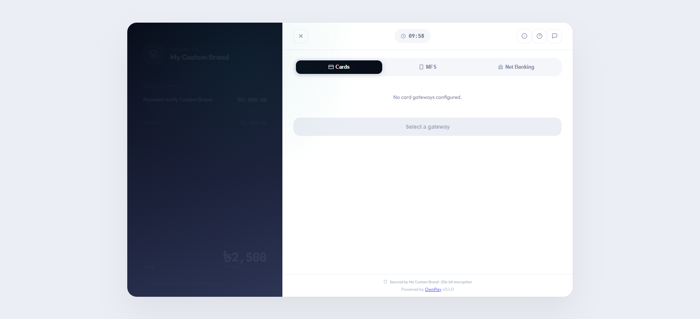

# Public Checkout & Payment Flow

> **Purpose:** The customer-facing checkout screen where users enter billing amounts, select payment methods, and complete payments.

---

## Overview

The Public Checkout and Payment flow is the customer-facing side of the OwnPay platform. It is fully white-labeled under the brand's custom domain and theme settings (colors, logo, and custom styles). The checkout experience is optimized for both desktop and mobile layouts to minimize payment friction.

---

## The Checkout Journey

Customers can reach the checkout interface through two primary methods:
1. **Direct API Checkout Redirect:** When an external shop or e-commerce platform initiates a transaction via the API, the customer is redirected to the secure URL `/checkout/{trx_id}`.
2. **Public Payment Links:** Visiting a payment link URL `/pay/{slug}` generated in the administrative panel.

---

## Page Sections

The checkout screen is split into a double-panel layout on desktop and a stacked responsive flow on mobile:

### 1. Left Panel (Order Summary)
* **Brand Branding:** Displays the active Brand's uploaded logo and name.
* **Payment Reference:** Displays the unique Transaction ID (e.g., `OP-D7B7D1B822`) and the purchase description.
* **Line Items Breakdown:** (When paying an invoice) Lists each line item, quantity, and unit price.
* **Total Summary:** The total amount and currency to be charged (e.g., `BDT 2,500.00`).

### 2. Right Panel (Payment Terminal)
* **Brand Header:** Links to the brand support email for customer assistance.
* **Session Expiry Timer:** (If enabled) A ticking countdown showing the remaining time to complete the transaction (defaults to 10 minutes) before the checkout session expires.
* **Express Checkout Area:** If configured, displays quick payment buttons (e.g., bkash Express, Nagad Quick Pay, Apple Pay) for one-click authorization.
* **Payment Methods Tabs:** Grouped tabs for different gateway classifications (e.g., *Mobile Banking*, *Credit/Debit Cards*, *Internet Banking*, *Manual*).
* **Gateway Selection Grid:** Selecting a payment option (e.g., Stripe, SSLCommerz, bkash, Nagad) redirects the customer to the secure processor portal or launches the manual payment instructions.

---

## Step-by-Step customer flows

### Flow A: Dynamic Payment Link (Amount Entry)
1. The customer visits a variable-amount payment link (e.g. `https://pay.mybrand.com/pay/donation`).
2. Because the amount is variable, the customer is presented with the **Enter Amount** page showing the link title and description.
3. The customer types the desired amount. The form automatically validates that the entry respects any minimum or maximum bounds configured by the merchant.
4. The customer clicks **Continue to Payment** and is redirected to the active transaction checkout room.

### Flow B: Secure Checkout (Standard Payment)
1. On the checkout screen, the customer reviews their order details in the left panel.
2. In the payment terminal on the right, they select their preferred payment method (e.g., **Cards**).
3. They click the specific provider logo (e.g., **Visa/Mastercard**).
4. **Gateway Redirect:** The system securely redirects the customer to the gateway’s payment processing page (e.g., SSLCommerz, Stripe) to input credentials.
5. **Gateway Return:** After completing payment, the gateway redirects the customer back to the OwnPay checkout status page.

### Flow C: Manual Payment Flow
1. The customer selects the **Manual Payment** tab on the checkout screen.
2. They select the specific manual gateway (e.g., **bkash Manual** or **Bank Transfer**).
3. The page displays step-by-step instructions configured by the brand (e.g., *"Send money to bkash Personal 017XXXXXXXX"*).
4. The customer performs the transaction on their mobile device or banking app.
5. Once completed, the customer returns to the checkout screen and inputs the requested details:
   * **Sender Account:** The phone number or bank account from which they sent the money.
   * **Transaction ID (TrxID):** The reference code received from the payment network.
6. The customer clicks **Submit Payment**.
7. The transaction status is updated to `Pending Verification`. The brand staff must verify the payment ledger manually before completing the order.

---

## Checkout Status Pages

After payment processing completes, the customer is routed to one of four status landing screens:

| Status Screen | Icon / Color | Description | Customer Action |
|---|---|---|---|
| **Success** | Green Check | Payment verified by the gateway (or manually approved by staff). Displays the brand's custom success message and receipt details. | Click **Return to Merchant** or download the invoice PDF. |
| **Pending Verification** | Yellow Clock | Appears for manual payments. The transaction is logged, waiting for staff validation. | Customer can close the page; they will receive an email invoice once approved. |
| **Failed** | Red Cross | Payment was declined, failed, or aborted by the gateway. Displays the brand's custom failure message. | Click **Try Again** to return to the gateway grid. |
| **Expired** | Gray Timer | Appears if the countdown timer hits 0 before payment is detected, or if the payment link is disabled. | Returns an expiration warning. Customer must request a new payment link. |

---

## Configuration Guide

* **Custom Style Injector:**
  * Checkout pages fetch custom styles and colors dynamically using `BrandThemeService::getBrandTheme($merchantId)`. The brand's primary color is used for buttons, borders, and active tabs.
* **Security & Anti-Tampering:**
  * OwnPay uses high-security HMAC verification (`checkout_hash`) computed using `HMAC_KEY` or `APP_KEY`. This prevents customers from altering checkout amounts or currencies in transit.
  * All customer interfaces block Search Engine indexing (`noindex,nofollow` meta tags) for security and privacy.

---

## Best Practices

- ✅ **Do:** Test checkout pages across mobile layouts, as a large majority of mobile-banking customers in Bangladesh pay using mobile screens.
- ✅ **Do:** Configure a reasonable **Support Email** in brand settings, as customers look here first if a payment fails.
- ❌ **Don't:** Set the session timer too short (less than 5 minutes), as customers need time to input SMS OTP verification codes sent by their banks or wallets.

---

## Must Do

> [!IMPORTANT]
> To comply with PCI-DSS standards, the checkout templates and assets do not store credit card details or bank passwords on the local server. All card forms must be served securely using gateway tokens or offsite redirects.

---

## Troubleshooting

### Checkout page shows "HMAC_KEY or APP_KEY must be configured"
* **Cause:** The platform configuration is missing secure signing keys.
* **Solution:** Ensure `APP_KEY` is set in the main `.env` configuration file and that settings are initialized.

### Transaction timer expires instantly
* **Cause:** The server time is out of sync with the user's local device time.
* **Solution:** Verify the server timezone settings and configure NTP time synchronization on the hosting environment.

---

## Related Pages

- [Transactions](../payments/transactions.md) — View and audit customer payment statuses from the admin panel.
- [Payment Links](../payments/payment-links.md) — Configure the slugs and bounds for payment links.
- [Gateways](../gateways/gateways.md) — Manage the payment providers available on the checkout screen.
