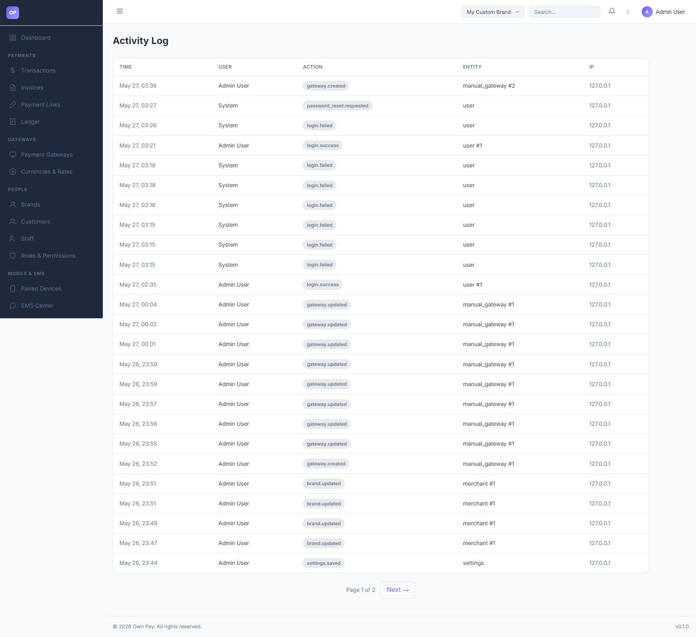

# Audit Log

> **Purpose:** Track administrative actions, staff logins, config changes, and security events.

---

## Overview

The Audit Log (Activities) page serves as a read-only, chronological trail of all administrative actions performed across the platform. It logs critical events like staff logins, gateway updates, settings edits, and database manipulations, alongside metadata like user ID, timestamp, and IP address.

---

## Getting Here

To access the Audit Log:
1. Log in to the OwnPay admin dashboard.
2. Under the **REPORTS & FINANCE** section in the left sidebar, click **Audit Log**.

---

## Page Sections

The Audit Log consists of the following key details:

### 1. Activity Log Table
Displays chronological entries:
* **TIME:** Month, day, and time of the event.
* **USER:** The username or system actor (e.g. `Admin User`, `System`).
* **ACTION:** Event identifier (e.g. `gateway.created`, `login.success`, `brand.updated`).
* **ENTITY:** Target ID of the modification (e.g. `manual_gateway #2`, `user #1`).
* **IP:** The IP address of the user who performed the action.

### 2. Pagination Nav Bar
Located at the bottom of the table, showing **Page X of Y** and a **Next →** link to browse historical entries.

---

## Fields & Options Reference

### Activity Log Column Reference
| Table Header | Type | Description |
|---|---|---|
| **TIME** | Timestamp | The exact timestamp when the activity occurred. |
| **USER** | Text | The administrative account executing the action. |
| **ACTION** | Identifier | The system action tag (e.g. `login.failed`, `settings.saved`). |
| **ENTITY** | Text Code | The target component modified (e.g. `merchant #1`). |
| **IP** | IP Address | Network location from which the request originated. |

---

## Step-by-Step: How to Use This Page

### Tracking Unauthorized Login Attempts
1. Navigate to the **Audit Log** page.
2. Scan the **ACTION** column for `login.failed` event tags.
3. Check the **IP** address next to failed login attempts. If multiple failed attempts originate from an unknown IP address, consider blocking or rate-limiting that IP at your server firewall level.

### Auditing Configuration Changes
1. If a gateway stops functioning or brand color accents change:
2. Browse the **ACTION** column for `gateway.updated` or `brand.updated` tags.
3. Locate the timestamp corresponding to the issue.
4. Verify which **USER** performed the change to coordinate resolution.

---

## Configuration Guide

* **Audit Logs Persistence:**
  * Audit logs are written to the `op_audit_logs` database table.
  * These logs are immutable from the admin portal to protect history records.
  * In production contexts, system cron tasks should run to archive logs older than 90 days.

---

## Best Practices

- ✅ **Do:** Monitor failed login activities weekly to check for brute-force attempts.
- ✅ **Do:** Correlate ledger entries with manual gateway approvals by checking who approved the transaction in the activity log.
- ❌ **Don't:** Share raw audit logs with external partners.
- ❌ **Don't:** Disable logging triggers, as they are mandatory for security compliance.

---

## Must Do

> ⚠️ Activities are scoped by brand permissions. Staff users can only see log entries created under their own brand (`merchant_id`). Bypassing this scoping rule will lead to unauthorized data access.

---

## Related Pages

- [Staff](../people/staff.md) - Manage administrative user accounts.
- [Reports](./reports.md) - Analyze payment conversion data.
- [Developer Hub](../developers/developer-hub.md) - Monitor API and webhook logs.
