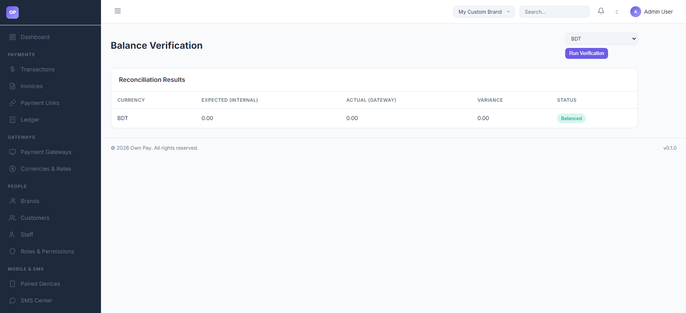

# Balance Verification

> **Purpose:** Reconcile and verify internal database transaction ledgers against actual payment processor states to prevent financial discrepancies.

---

## Overview

The Balance Verification page provides administrators with a direct financial reconciliation tool. It compares your internal double-entry ledger database states (**Expected Internal**) against the actual processed cash data retrieved directly from the payment gateway APIs (**Actual Gateway**). It computes the difference (**Variance**) and alerts you to imbalances.

---

## Getting Here

To access the Balance Verification tool:
1. Log in to the OwnPay admin dashboard.
2. Under the **REPORTS & FINANCE** section in the left sidebar, click **Balance Verification**.

---

## Page Sections

The Balance Verification portal is composed of the following panels:

### 1. Verification Controls
Located at the top of the workspace:
* **Currency Dropdown:** Select the target currency context to run the reconciliation on (e.g. `BDT` or `USD`).
* **Run Verification Button:** Triggers database queries and external gateway checks to perform the audit.

### 2. Reconciliation Results Table
Displays verification metrics:
* **CURRENCY:** Audited currency code.
* **EXPECTED (INTERNAL):** Net total calculated from internal double-entry ledger entries.
* **ACTUAL (GATEWAY):** Net total compiled from transaction logs registered across payment gateways.
* **VARIANCE:** The mathematical variance (Expected minus Actual). Ideally, this should show `0.00`.
* **STATUS:** Audit state indicator (e.g., `Balanced` in green, or `Discrepancy` in red).

---

## Fields & Options Reference

### Verification Results Reference
| Table Header | Type | Description |
|---|---|---|
| **CURRENCY** | Label | The currency denominator of the balance being checked. |
| **EXPECTED (INTERNAL)** | Currency | Aggregate balance computed from internal ledger entries (`op_ledger_entries`). |
| **ACTUAL (GATEWAY)** | Currency | Aggregate balance compiled from physical transaction tables (`op_transactions`). |
| **VARIANCE** | Currency | The discrepancy delta. Any non-zero value indicates a balance drift. |
| **STATUS** | Badge | Indicates whether the ledger balances match the transaction record: `Balanced` or `Variance Detected`. |

---

## Step-by-Step: How to Use This Page

### Running a Balance Audit
1. Navigate to the **Balance Verification** page.
2. Open the **Currency** dropdown and select the currency to verify (e.g. `BDT`).
3. Click the **Run Verification** button.
4. Scan the table for the **STATUS** badge:
   * If it shows **Balanced** with `0.00` variance, your accounting system is aligned.
   * If it shows **Variance Detected**, look at the **VARIANCE** column value to determine the size of the discrepancy.

---

## Configuration Guide

* **Discrepancy Resolution Protocol:**
  * Variance occurs if:
    1. A transaction failed to write a ledger entry (rare, as database transactions roll back if ledger updates fail).
    2. A database modification was performed directly without using PSR-11 services.
    3. Stale cache is showing outdated balance values.
  * If a variance is detected, run the system update diagnostics or review the **Audit Log** entries corresponding to the variance period.

---

## Best Practices

- ✅ **Do:** Run balance verifications before making settlements or payout distributions.
- ✅ **Do:** Perform audits during low-traffic periods to ensure pending checkout sessions do not cause temporary variance fluctuations.
- ❌ **Don't:** Ignore non-zero variance values, even if they are minor (e.g. pennies), as they indicate potential rounding anomalies or configuration drifts.

---

## Must Do

> ⚠️ Always post ledger transactions within a database transaction block. If writing custom plugins or addons that interact with balances, utilize the double-entry repository `OwnPay\Repository\LedgerRepository` to preserve balance integrity.

---

## Related Pages

- [Ledger](../payments/ledger.md) — Inspect individual accounting ledger sheets.
- [Transactions](../payments/transactions.md) — Monitor real-time transaction updates.
- [Audit Log](./audit-log.md) — Check modification actions history.
