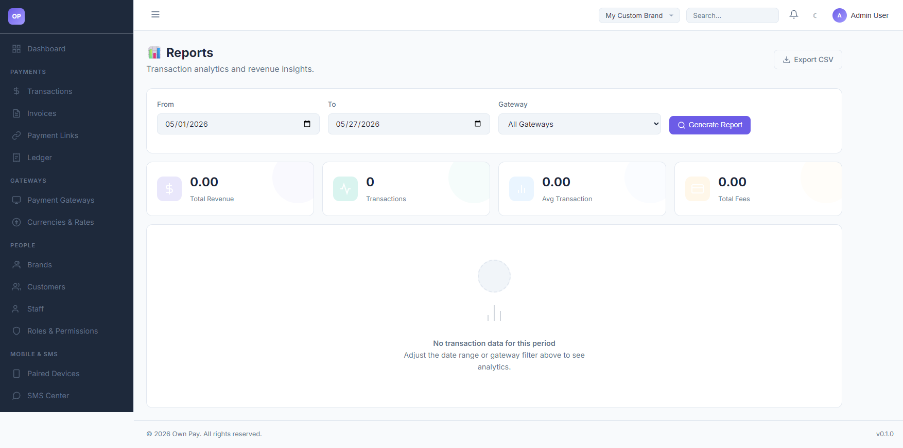

# Reports

> **Purpose:** Monitor business performance metrics, analyze transaction volumes, audit gateway fees, and export data.

---

## Overview

The Reports page compiles analytics for your active brand. It provides visual summary cards for key performance indicators (KPIs) like Total Revenue, Transactions Count, Average Transaction value, and Total Gateway Fees. You can run custom queries by filtering by dates and specific gateways, and download reports in CSV format.

---

## Getting Here

To access the Reports portal:
1. Log in to the OwnPay admin dashboard.
2. Under the **REPORTS & FINANCE** section in the left sidebar, click **Reports**.

---

## Page Sections

The Reports portal is split into three main components:

### 1. Filter Control Bar
Located at the top of the workspace:
* **From Date:** Start date of the audit window (defaulting to the first day of the current month).
* **To Date:** End date of the audit window (defaulting to the current day).
* **Gateway Dropdown:** Select a specific API or manual gateway to review, or select `All Gateways`.
* **Generate Report Button:** Refreshes page calculations and compiles metrics.
* **Export CSV Link:** Generates and initiates a download of the filtered raw transaction ledger list.

### 2. Summary KPI Cards
Shows calculations for the selected filter parameters:
* **Total Revenue:** The total value of all completed payments.
* **Transactions:** The total number of completed payments.
* **Avg Transaction:** The average ticket size calculated as (Total Revenue divided by Transactions count).
* **Total Fees:** The cumulative transaction fees processed by payment gateways.

### 3. Detailed Analytics Chart / Table
Displays detailed conversion metrics. If no transactions are registered in the selected window, it displays "No transaction data for this period".

---

## Fields & Options Reference

### Reports Query Fields
| Query Field | Type | Default | Description |
|---|---|---|---|
| **From Date** | Date Picker | 1st of current month | The start of the reporting period. |
| **To Date** | Date Picker | Current Date | The end of the reporting period. |
| **Gateway** | Select | All Gateways | Filter analytics to a specific payment gateway. |
| **Export CSV** | Link | - | Download option for raw spreadsheet data. |

---

## Step-by-Step: How to Use This Page

### Filtering Analytics by Period
1. Click the **From** input field and choose the start date.
2. Click the **To** input field and choose the end date.
3. If you want to isolate a single wallet, open the **Gateway** dropdown and select the gateway (e.g. `Nagad Personal`).
4. Click **Generate Report**. The summary cards will update instantly.

### Exporting Transactions to CSV Spreadsheet
1. Configure your date range and gateway filters as described above.
2. Click the **Export CSV** link next to the main header.
3. The platform will download a file named `report_{from}_{to}.csv` containing transaction IDs, gateway slugs, currencies, amounts, statuses, and timestamps.

---

## Configuration Guide

* **CSV Data Mapping:**
  * When exporting data:
    * The system loops over the `op_transactions` database records scoped to your active brand.
    * The output columns map directly to: `ID`, `Gateway`, `Currency`, `Amount`, `Status`, `Date`.
    * Refunded gateway fees are deducted from the net calculation outputs.

---

## Best Practices

- ✅ **Do:** Regularly export CSV logs and archive them to secure local servers for bookkeeping backup.
- ✅ **Do:** Compare **Total Fees** metrics against your physical statements to ensure gateway fee percentages are configured correctly.
- ❌ **Don't:** Select excessively wide date ranges (e.g., more than 1 year) if your brand processes thousands of transactions daily, as this can slow down server responses.
- ❌ **Don't:** Share CSV reports containing customer transaction IDs and personal contact details with unauthorized staff.

---

## Must Do

> ⚠️ Double-check that your base default currency matches your report expectations. If your brand context defaults to BDT, all amounts shown in the reports cards represent BDT values.

---

## Related Pages

- [Transactions](../payments/transactions.md) - Review individual customer invoices and payments.
- [Ledger](../payments/ledger.md) - View double-entry debit and credit lines.
- [Audit Log](./audit-log.md) - Track actions performed by staff users.
