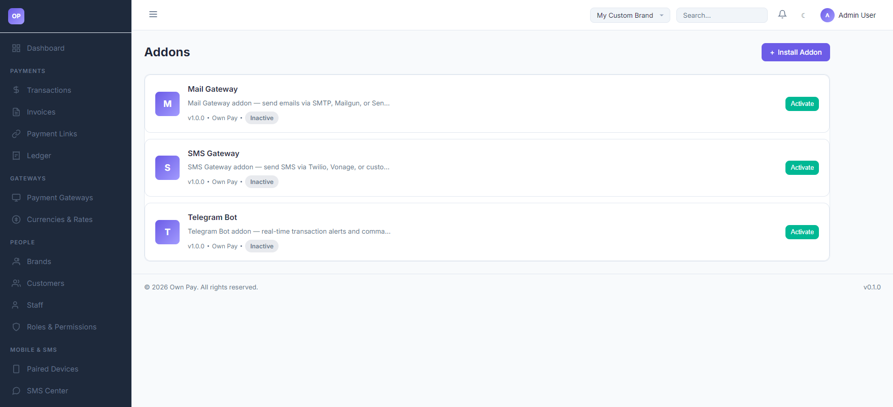

# Addons

> **Purpose:** Activate and manage secondary non-gateway utility plugins (like Email wrappers, SMS senders, or Telegram bots).

---

## Overview

The Addons page lists auxiliary plugins installed on the OwnPay system. Unlike payment gateways that handle cash checkout interfaces, addons provide backend utility services, like forwarding system emails, sending checkout SMS links to customers, or sending instant alert notifications to Telegram channels.

---

## Getting Here

To access the Addons list:
1. Log in to the OwnPay admin dashboard as the super-administrator.
2. Under the **SYSTEM** section in the left sidebar, click **Addons**.

---

## Page Sections

The Addons panel contains the following modules:

### 1. Header Actions
* **Install Addon Link:** Opens the plugin file uploader panel (`/admin/plugins/install`) to upload custom zip packages.

### 2. Addon Cards List
Lists all functional helper modules:
* **Mail Gateway:** Integrates with SMTP, Mailgun, or SendGrid to send transaction receipts and system notifications.
* **SMS Gateway:** Integrates with Twilio, Vonage, or custom HTTP SMS APIs to send payment links and verify phone numbers.
* **Telegram Bot:** Configures outbound bots to deliver instant payment notifications directly to Telegram chat channels.
* **Card Options:** Displays the addon title, description, version, publisher name, active status (`Active` or `Inactive`), and an **Activate** button to enable it.

---

## Step-by-Step: How to Use This Page

### Activating an Addon
1. Navigate to the **Addons** manager.
2. Choose the addon you want to use (e.g. **Mail Gateway**).
3. Click the **Activate** button on the card.
4. The status changes to active. The system settings menu will append a new configuration tab (e.g., a new tab for Mail or SMS settings) to let you enter API credentials.

---

## Best Practices

- ✅ **Do:** Keep the **Mail Gateway** addon active to ensure clients automatically receive transaction invoices and payment confirmations.
- ✅ **Do:** Deactivate unused addons to save server processing memory resources.
- ❌ **Don't:** Run duplicate notification handlers (e.g., sending both Telegram and Slack alerts for every checkout) if you want to optimize webhook speed.

---

## Related Pages

- [Plugins](./plugins.md) — View and manage all platform extensions.
- [System Settings](./settings.md) — Configure general localization settings.
- [System Update](./system-update.md) — Perform core system code updates.
