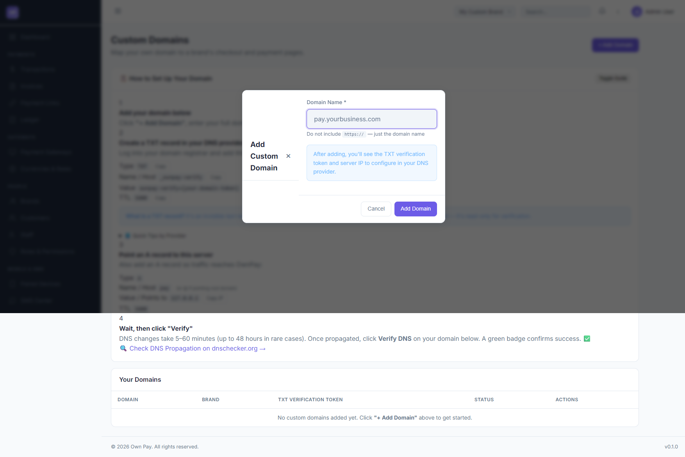

# Custom Domains

> **Purpose:** Map your own custom domain (e.g. `pay.yourbusiness.com`) to a brand's checkout and payment pages for white-labeled branding.

---

## Overview

The Custom Domains management screen allows administrators to configure custom hostnames for different brands under the same OwnPay instance. Setting up custom domains hides the master OwnPay platform domain, providing a fully white-labeled billing and checkout interface to customers.

---

## Getting Here

To access the Custom Domains settings:
1. Log in to the OwnPay admin dashboard as the super-administrator.
2. Under the **SYSTEM** section in the left sidebar, click **Domains**.

---

## Page Sections

The Custom Domains manager consists of three main visual and functional areas:

### 1. DNS Setup Guide
A collapsible instructional card detailing the steps required to link your domain:
* **TXT Verification record:** Details to authenticate domain ownership (Type, Name, Value, TTL).
* **A record:** Details to point traffic to the OwnPay server IP address.
* **Provider-specific Quick Tips:** Cloudflare, GoDaddy, and Namecheap zone manager shortcuts.

### 2. Your Domains Table
Lists all mapped hostnames for the active brand context:
* **Domain:** Shows the domain name, along with a **Visit** link for verified active domains.
* **Brand:** Displays the specific Brand (Merchant) to which the domain is mapped.
* **TXT Verification Token:** The unique verification code required to authorize ownership in DNS.
* **Status:** Badges indicating the domain state:
  * `✓ Verified` (green): Fully configured, active, and accessible.
  * `Pending DNS` (yellow): Domain added, waiting for DNS records to propagate.
  * `Error/Invalid` (red): DNS check failed or verification is incomplete.
* **Actions:**
  * **Verify DNS:** Submits a query to trigger TXT and A record validations.
  * **Remove:** Unlinks and deletes the domain mapping from the platform.

### 3. Add Custom Domain Modal
Triggered by clicking the **+ Add Domain** button in the header, containing the domain registration form.

---

## Fields & Options Reference

### Add Custom Domain Form Reference
| Field Name | Type | Required? | Example / Default | Description |
|---|---|---|---|---|
| **Domain Name** | Text Input | Yes | pay.yourbusiness.com | The full hostname to map (do not include `https://` or path prefixes). |

---

## Step-by-Step: How to Use This Page

### Mapping and Verifying a New Custom Domain

#### Step 1: Register the Domain in OwnPay
1. Navigate to **SYSTEM → Domains**.
2. Click **+ Add Domain** in the top-right corner.
3. In the modal, enter your hostname (e.g., `pay.mybrand.com`) in the **Domain Name** field.
4. Click **Add Domain**.
5. The domain will appear in the table with a `Pending DNS` status badge and a unique verification token.

#### Step 2: Configure TXT Record (Ownership Verification)
1. Log in to your DNS registrar or provider (e.g. Cloudflare, GoDaddy, Namecheap).
2. Go to your domain's DNS Zone Editor or DNS Management panel.
3. Add a new **TXT** record with the following:
   * **Name / Host:** `_ownpay-verify` (or full FQDN: `_ownpay-verify.pay.mybrand.com`)
   * **Value:** `ownpay-verify={your-verification-token}` (copy this from the OwnPay domain table row)
   * **TTL:** `3600` (or `1 hour` / `Auto`)

#### Step 3: Configure A Record (Traffic Routing)
1. In the same DNS registrar panel, add a new **A** record:
   * **Name / Host:** `pay` (or `@` if mapping your root domain like `mybrand.com`)
   * **Points to / Value:** Enter the platform's Server IP (copy the IP shown in Step 3 of the DNS Setup Guide on the page).
   * **TTL:** `3600`

#### Step 4: Verify and Activate
1. Wait 5 to 60 minutes for DNS records to propagate.
2. Return to the **SYSTEM → Domains** panel in OwnPay.
3. Locate your domain in the table and click **Verify DNS** in the actions column.
4. If records match, the status badge will update to `✓ Verified`. The domain is now live and will route customer payments white-labeled under that URL.

---

## Configuration Guide

* **Automatic Routing:**
  * Once verified, any HTTP requests hitting the server with that custom Host header are mapped directly to the corresponding brand (`merchant_id`).
  * Custom domains are strictly customer-facing. Administrative routes (e.g. `/admin/*`) accessed via a custom domain will return an immediate **404 Not Found** error. The admin panel is strictly reserved for the master `APP_DOMAIN`.
* **DNS Verification Cron:**
  * OwnPay runs a background job (`DnsVerificationJob`) every 6 hours to recheck and confirm verification status for pending domains.

---

## Best Practices

- ✅ **Do:** Use a subdomain (like `pay.yourdomain.com` or `billing.yourdomain.com`) instead of the root apex domain when possible, for easier DNS and CDN administration.
- ✅ **Do:** Verify propagation on third-party tools like `dnschecker.org` before clicking the platform Verify button.
- ❌ **Don't:** Map the same domain to multiple brands, as hostname mapping must be 1:1.
- ❌ **Don't:** Enable Cloudflare proxy status (orange cloud) for the TXT verification record, as it can block validation queries. Keep proxy settings to **DNS only** during verification.

---

## Must Do

> [!IMPORTANT]
> To prevent domain mapping vulnerabilities and DNS hijacking:
> 1. Always verify the domain's TXT record before routing traffic.
> 2. Ensure custom domains map correctly to the brand context. Bypassing DNS verification runs the risk of routing errors or broken checkout sessions.

---

## Optional

* **SSL/TLS Certificates:** OwnPay's reverse proxy or server configuration (like Nginx, Laragon, Caddy, or Apache) must be configured to handle SSL termination for newly added domains. Contact your server administrator to add the new hostname to your SSL auto-renewal lists.

---

## Troubleshooting

### Domain status remains "Pending DNS" after clicking Verify
* **Cause:** DNS propagation delays.
* **Solution:** DNS zone records take time to sync globally. Wait up to 1 hour and try again.
* **Cause:** Incorrect Host/Name value.
* **Solution:** Some registrars append your root domain automatically. If you enter `_ownpay-verify.pay.mybrand.com` in GoDaddy, they might set it to `_ownpay-verify.pay.mybrand.com.pay.mybrand.com`. In most DNS managers, simply entering `_ownpay-verify` or `_ownpay-verify.pay` in the host input field is sufficient. Check the exact values using a DNS Lookup tool.

### Accessing Custom Domain returns a 404 page
* **Cause:** The A record is not pointed to the correct server IP, or the domain has not been verified yet.
* **Solution:** Verify the A record configuration and run verification in the admin panel.

---

## Related Pages

- [Brands](../people/brands.md) — Create and manage brands mapped to custom domains.
- [Branding Settings](../appearance/branding-settings.md) — Upload logos and visual details for your brand context.
- [System Settings](./settings.md) — Configure global application name and fallback URL parameters.

---

## Notes

* Custom domains are fully isolated via `DomainMiddleware`. Active custom domains verify DNS settings automatically to prevent configuration leakage.
