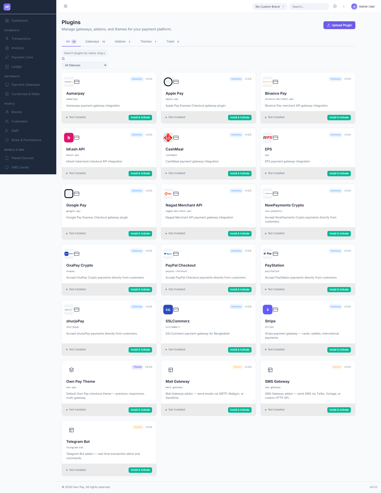

# Plugins

> **Purpose:** Manage modular platform extensions, install custom addons, and toggle gateway services.

---

## Overview

The Plugins manager allows administrators to extend OwnPay's core capabilities. Extensions are packaged as plugins and are grouped into three categories: **Gateways** (API connectors), **Addons** (additional platform features like email alerts or Telegram bots), and **Themes** (layout designs).

---

## Getting Here

To access the Plugins manager:
1. Log in to the OwnPay admin dashboard as the super-administrator.
2. Under the **SYSTEM** section in the left sidebar, click **Plugins**.

---

## Page Sections

The Plugins manager is structured into the following areas:

### 1. Plugin Category Tabs
Filter extensions by type:
* **All:** Shows all 19 plugins on the server.
* **Gateways:** Lists only payment processor connectors (e.g. Aamarpay, SSLCommerz, Stripe).
* **Addons:** Displays helper integrations (`mail-gateway`, `sms-gateway`, `telegram-bot`).
* **Themes:** Shows visual templates.
* **Trash:** Displays uninstalled plugins queued for deletion.

### 2. Search & Filter Bar
* **Search Textbox:** Locate plugins by name or slug.
* **Status Dropdown:** Filter by `Active`, `Inactive`, or `Not Installed` status states.

### 3. Plugin Profile Cards
Each card displays:
* **Branding Icon:** Visual logo of the extension.
* **Details:** Extension name, type tag (Gateway/Addon/Theme), version, and description.
* **Controls:** Click **Install & Activate** (or **Deactivate** if active) to modify execution states.

### 4. Upload Plugin Wizard
Located by clicking the **Upload Plugin** link in the header:
* Allows developers to upload a custom packaged `.zip` plugin file directly to the server.

---

## Step-by-Step: How to Use This Page

### Installing and Activating a Plugin
1. Navigate to the **Plugins** manager.
2. Search or browse to locate the extension (e.g., **Telegram Bot**).
3. Click the **Install & Activate** button.
4. The system will extract the package, run configuration migrations, and change the status. If it is a gateway, it will now appear in your **Payment Gateways** list.

---

## Configuration Guide

* **The Plugin Sandbox:**
  * OwnPay runs plugins under a secure sandbox (`PluginSandbox` or `PluginLoader`) to isolate third-party code.
  * Manifest slugs in database records must match filesystem folder names exactly.
  * Logo paths are copied dynamically from the modules folder to the public assets directory on the fly when the logo is rendered.

---

## Best Practices

- ✅ **Do:** Deactivate plugins you are not using to improve system performance.
- ✅ **Do:** Check for version compatibility in the manifest description before uploading manual updates.
- ❌ **Don't:** Upload zip archives from untrusted sources, as plugins run with administrative permissions.
- ❌ **Don't:** Rename plugin folder directories directly via FTP/file manager, as this will break database manifest lookups.

---

## Related Pages

- [Payment Gateways](../gateways/gateways.md) — Configure credentials for activated gateways.
- [Themes](../appearance/themes.md) — Manage active visual styles.
- [System Update](./system-update.md) — Upload master platform core updates.
