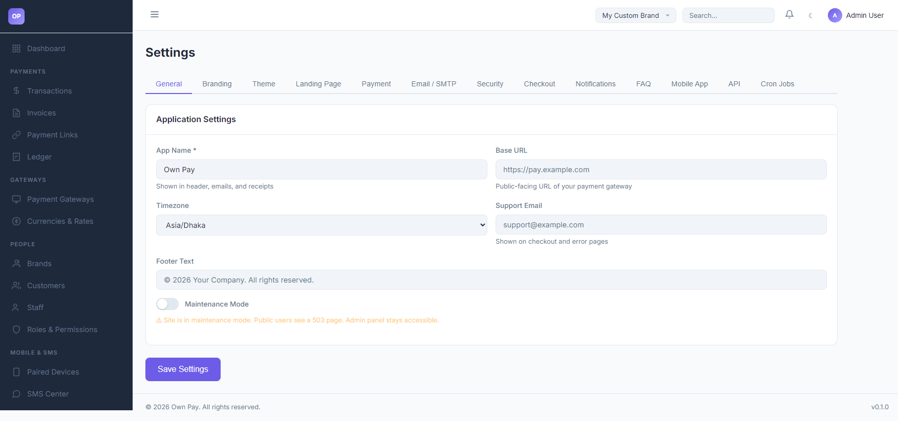

# System Settings

> **Purpose:** Manage global system settings, configure timezones, adjust public base URLs, and toggle maintenance mode.

---

## Overview

The System Settings panel is the master configuration board for your OwnPay platform. It handles localization, email support mappings, dashboard titles, public base URLs, and platform maintenance controls.

---

## Getting Here

To access the System Settings:
1. Log in to the OwnPay admin dashboard as the super-administrator.
2. Under the **SYSTEM** section in the left sidebar, click **Settings**.
3. The page defaults to the **General** settings tab.

---

## Page Sections

The General settings panel is divided into two sections:

### 1. Application Settings
* **App Name:** The visual name of the platform (e.g. `Own Pay`), injected into headers, customer emails, and payment invoices.
* **Base URL:** The primary domain name where OwnPay is hosted (e.g., `https://pay.example.com`), used to construct links for checkout routes.
* **Timezone:** Dropdown to select the default system timezone. This offset aligns financial reports, transaction timestamps, and logs.
* **Support Email:** The global support email address displayed on checkout flows and payment error screens.
* **Footer Text:** Custom copyright or company text shown at the bottom of the admin panel.

### 2. Maintenance Mode Control
* **Maintenance Mode Toggle:** When enabled, all customer-facing checkout screens and landing pages are blocked, returning an HTTP **503 Service Unavailable** page. The administrative dashboard remains fully accessible to logged-in staff.

---

## Fields & Options Reference

### General Settings Field Reference
| Field Name | Type | Required? | Example / Default | Description |
|---|---|---|---|---|
| **App Name** | Text Input | Yes | Own Pay | Platform visual name. |
| **Base URL** | Text Input | No | https://pay.example.com | Main server access URL. |
| **Timezone** | Select | Yes | Asia/Dhaka | Sets localized reporting offsets. |
| **Support Email** | Text Input | Yes | support@example.com | Customer contact for support issues. |
| **Footer Text** | Text Input | No | © 2026 Your Company... | Copyright footer text. |
| **Maintenance Mode** | Switch | No | Disabled | Block public checkout routes for audits. |

---

## Step-by-Step: How to Use This Page

### Updating System Timezone
1. Navigate to **SYSTEM → Settings**.
2. Scroll to the **Timezone** dropdown.
3. Select your local timezone (e.g., `Asia/Dhaka` or `Europe/London`).
4. Click **Save Settings** in the footer to apply.

### Activating Maintenance Mode
1. Scroll down to the **Maintenance Mode** section.
2. Toggle the switch to active.
3. Click **Save Settings**.
4. Test that public root URLs return a 503 page, while your admin session continues to work.

---

## Best Practices

- ✅ **Do:** Verify that the **Base URL** matches your SSL certificate protocol (`https://`), as insecure endpoints can cause API connection drops.
- ✅ **Do:** Enable **Maintenance Mode** when uploading platform updates or refactoring database structures.
- ❌ **Don't:** Change the timezone frequently, as it can cause visual anomalies in daily reporting charts.
- ❌ **Don't:** Enter a trailing slash `/` at the end of your Base URL field.

---

## Must Do

> ⚠️ Runtime settings are saved in the `op_system_settings` table under the `runtime` group. Bypassing settings API calls by writing raw database queries can lead to cache mismatch errors. Always edit settings through this panel or the `EnvironmentService::get()` container wrappers.

---

## Related Pages

- [Branding Settings](../appearance/branding-settings.md) — Upload logos and favicons.
- [Landing Page Settings](../appearance/landing-page.md) — Manage public home page content.
- [Domains](./domains.md) — Setup custom domains.
