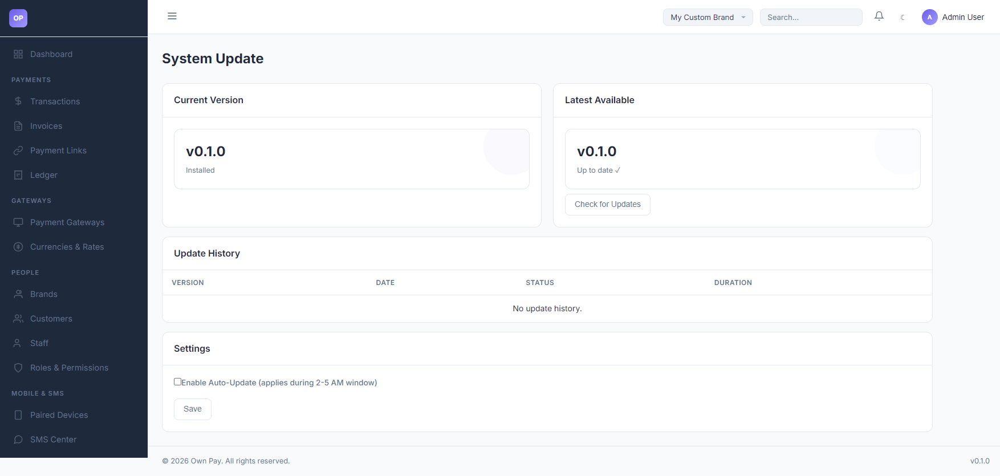

# System Update

> **Purpose:** View the current platform version, check for new releases, install core system updates, and view installation history.

---

## Overview

The System Update panel allows administrators to keep their OwnPay platform up to date. Keeping the platform updated ensures you have the latest features, security patches, and gateway integration fixes.

---

## Getting Here

To access the System Update page:
1. Log in to the OwnPay admin dashboard as the super-administrator.
2. Under the **SYSTEM** section in the left sidebar, click **System Update** (listed in the sidebar as System Update or accessed via the System submenu).

---

## Page Sections

The System Update dashboard is divided into four primary areas:

### 1. Current Version Card
Displays the currently installed and active version of the OwnPay platform (e.g., `v0.1.0`).

### 2. Latest Available Card
* If the system is up to date, it displays the current version with a green `Up to date ✓` badge and a **Check for Updates** button.
* If a newer release is found on the update server, it displays the new version with an `Update Available!` badge, along with a button to **Update to v{version}** to trigger the update process.

### 3. Update History Table
Logs all previous system update executions on this server:
* **Version:** The version migration path (e.g. `v0.1.0` → `v0.1.1`).
* **Date:** The start timestamp of the update process.
* **Status:** Badges indicating the installation outcome:
  * `completed` (green): Update succeeded, migrations ran, and code files were updated.
  * `failed` (red): Update failed. The system rolled back to the previous version.
  * `running` (yellow): Update is in progress.
* **Duration:** The time taken in seconds for the update run.

### 4. Settings Card
Contains configuration options for automating system updates:
* **Enable Auto-Update:** Toggle checkbox to allow the system to download and apply updates automatically.

---

## Fields & Options Reference

### Update Settings Reference
| Field Name | Type | Required? | Example / Default | Description |
|---|---|---|---|---|
| **Enable Auto-Update** | Checkbox | No | Disabled | If enabled, the system automatically checks for, downloads, and applies core updates during the low-traffic window (2:00 AM – 5:00 AM). |

---

## Step-by-Step: How to Use This Page

### Checking for Updates manually
1. Navigate to **SYSTEM → System Update**.
2. In the **Latest Available** card, click the **Check for Updates** button.
3. The platform will query the master update server and return a success flash message displaying if a new update is found.

### Installing a Core Update
1. If an update is available, click the green **Update to v{latest_version}** button in the **Latest Available** card.
2. A confirmation dialog will appear warning you that the system will backup files, apply updates, and run database migrations. Click **OK** to confirm.
3. The system will enter maintenance mode, download the package, verify files using the public signature key, backup the existing codebase, run any migrations, and then reload the platform.
4. Once completed, you will be redirected to the dashboard with a success notification.

---

## Configuration Guide

* **Update Verification Security:**
  * OwnPay verifies all downloaded updates using asymmetric key cryptography. The system public key (`update_public_key.pem`) is stored in the root directory and is used to verify the signature of downloaded update archives before extraction.
* **Maintenance Escape Hatch:**
  * During update execution, the `/admin/system-update` path remains accessible to prevent administrator lockouts in the event of an update interruption.

---

## Best Practices

- ✅ **Do:** Perform a full database and filesystem backup before applying major version updates manually.
- ✅ **Do:** Review the release notes or changelog before applying updates to prepare staff for any UI changes.
- ❌ **Don't:** Turn off or reload the server while an update is installing, as this can corrupt database states or files.
- ❌ **Don't:** Modify core files directly in the `src/` or `public/` folder, as updates will overwrite custom code changes. Use the Plugin system instead.

---

## Must Do

> [!IMPORTANT]
> Always verify that write permissions are enabled on the `storage/` and root directories before attempting an update. If the web server lacks write access, the update script will fail to download and extract core updates.

---

## Optional

* **Automatic Updates:** If you have active daily transactions and prefer hands-off maintenance, toggle **Enable Auto-Update** so critical patches are applied automatically in the early morning hours.

---

## Troubleshooting

### Update fails with permission errors
* **Cause:** Web server (e.g. `www-data` or PHP-FPM process) does not have write access to the root codebase directory.
* **Solution:** Adjust folder permissions to allow write operations, or run the update manually using the CLI.

### The system is stuck in maintenance mode after an update
* **Cause:** The update process was interrupted, or a post-update database migration failed.
* **Solution:** Check `storage/logs/` for details. You can manually disable maintenance mode by deleting the `storage/.maintenance` or `storage/.installed` locking marker files if they exist, or check the database settings.

---

## Related Pages

- [Plugins](./plugins.md) — Install and activate modular gateway or addon extensions.
- [System Settings](./settings.md) — Adjust global runtime settings and localized timezone offsets.

---

## Notes

* Update history is tracked in the `op_update_history` table. The platform retains backups of the previous version folder in the storage cache to allow clean rollbacks on failure.
